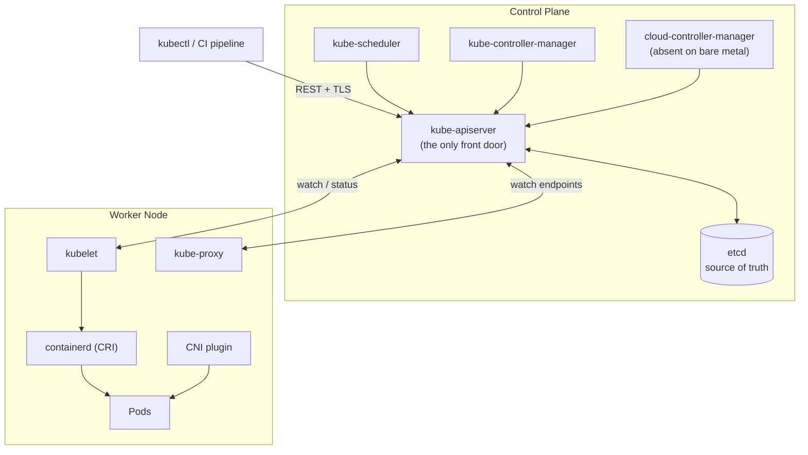

# 02 - Self-Hosted Kubernetes from Scratch

> Part of the **cicd-ecs-security-E2E** lab. The main pipeline ships the app to **AWS ECS Fargate**. This guide is the parallel track: how to stand up your **own** Kubernetes cluster on plain Linux VMs (cloud instances or bare metal) so you can later run the very same containerized app on Kubernetes you operate end-to-end - no managed control plane, no hidden magic.
>
> Tested against **Kubernetes v1.29 - v1.31** conventions (the `pkgs.k8s.io` package repos, `containerd` runtime, `kubeadm` bootstrap). Commands are current for 2025-2026.

---

## Table of Contents

1. [Kubernetes Architecture](#1-kubernetes-architecture)
2. [Self-Hosting Options Compared](#2-self-hosting-options-compared)
3. [Primary Path - A kubeadm Cluster, Step by Step](#3-primary-path--a-kubeadm-cluster-step-by-step)
4. [Exposing Apps on Bare Metal](#4-exposing-apps-on-bare-metal)
5. [Storage](#5-storage)
6. [Day-2 Operations](#6-day-2-operations)
7. [Production Hardening](#7-production-hardening)
8. [Fast Alternative - k3s in One Command](#8-fast-alternative--k3s-in-one-command)
9. [Production Readiness Checklist](#9-production-readiness-checklist)

---

## 1. Kubernetes Architecture

Kubernetes is a **declarative, desired-state system**. You tell it *what* you want (3 replicas of nginx, exposed on port 80); a set of cooperating controllers continuously work to make reality match that wish. Understanding the moving parts is what separates "I copied a YAML file" from "I can debug this at 3 a.m."

### 1.1 The two planes

| Plane | Runs where | Responsibility |
|-------|-----------|----------------|
| **Control plane** | One or more "master" / control-plane nodes | Stores cluster state, makes scheduling decisions, runs reconciliation loops |
| **Data plane (nodes)** | Worker nodes | Actually run your container workloads |

### 1.2 Control plane components

| Component | What it does | Why it matters |
|-----------|-------------|----------------|
| **kube-apiserver** | The **only** front door. REST API that validates, authenticates, authorizes every request and persists it. Everything (kubectl, kubelet, controllers) talks *through* it. | Stateless and horizontally scalable. If it's down, nothing changes (running pods keep running, but you can't schedule/update). |
| **etcd** | Distributed, consistent key-value store (Raft consensus). The **single source of truth** - every object lives here. | Lose etcd without a backup = lose your cluster. Quorum needs an **odd** number of members (3 or 5). |
| **kube-scheduler** | Watches for unscheduled Pods, picks the best node based on resource requests, affinity/anti-affinity, taints/tolerations, topology spread. | It only *decides* placement (writes `nodeName`); it does not start containers. |
| **kube-controller-manager** | Runs the built-in control loops: Node, ReplicaSet, Deployment, Job, EndpointSlice, ServiceAccount, etc. | This is the "reconciliation engine." |
| **cloud-controller-manager (CCM)** | Integrates with a cloud provider: provisions LoadBalancers, attaches volumes, labels nodes with zone/region, removes deleted instances. | **On bare metal you usually run *no* CCM** - which is exactly why `type: LoadBalancer` does nothing until you add MetalLB (see §4). |

### 1.3 Node components (run on every node, including control-plane nodes)

| Component | What it does |
|-----------|-------------|
| **kubelet** | The node agent. Watches the apiserver for Pods assigned to its node, then tells the container runtime to start/stop containers and reports status + health (liveness/readiness probes) back. |
| **kube-proxy** | Programs the node's networking (iptables or IPVS / increasingly eBPF via the CNI) so that traffic to a Service's virtual IP is load-balanced to the backing Pods. |
| **Container runtime (containerd)** | Pulls images and runs containers via the **CRI** (Container Runtime Interface). Docker Engine is *not* used directly anymore - `dockershim` was removed in v1.24. `containerd` (or CRI-O) is the standard. |

### 1.4 Request flow & the reconciliation loop

When you run `kubectl apply -f deployment.yaml`:

1. `kubectl` authenticates to **kube-apiserver** and submits the Deployment object.
2. apiserver **authenticates → authorizes (RBAC) → runs admission controllers → validates → writes to etcd**, then returns `201 Created`.
3. The **Deployment controller** (in controller-manager) notices a Deployment with no matching ReplicaSet and creates one.
4. The **ReplicaSet controller** notices it needs N Pods and creates N Pod objects (status: *Pending*, no node).
5. The **scheduler** sees Pending Pods, picks nodes, patches each Pod's `spec.nodeName`.
6. The **kubelet** on each chosen node sees "a Pod for me," asks **containerd** (via CRI) to pull images and start containers, and the **CNI** plugin wires up Pod networking.
7. kubelet reports the Pod as *Running*; the **EndpointSlice controller** adds healthy Pod IPs to the Service; **kube-proxy** updates routing so traffic reaches them.

Every controller follows the same shape - the **reconcile loop**:

```text
for ever:
    desired = read spec from apiserver (what user wants)
    actual  = observe the world
    if desired != actual:
        take action to converge
```

This **level-triggered** (not edge-triggered) design is why Kubernetes is self-healing: kill a Pod and the ReplicaSet controller re-creates it; the desired count never changed.



> ⚠️ **Pitfall:** People say "the master is down so my app is down." Usually false. Running Pods keep serving traffic even with the entire control plane offline - kubelet and kube-proxy run locally. What you *lose* is the ability to **change** anything (scheduling, scaling, self-healing). This is also why control-plane HA matters but isn't an instant-outage risk.

---

## 2. Self-Hosting Options Compared

There is no single "install Kubernetes" - you pick a distribution/installer that matches your goals.

| Tool | What it is | Footprint | Best for | Trade-offs |
|------|-----------|-----------|----------|-----------|
| **kubeadm** | The official, upstream cluster bootstrapper. You assemble nodes, OS, runtime, CNI yourself. | Standard full K8s | **Learning the real thing**, full control, the closest "from CNCF" experience. *This guide's primary path.* | You own every piece (CNI, storage, LB, upgrades). Most assembly required. |
| **k3s** | Rancher's lightweight, CNCF-certified distro. Single ~70 MB binary, bundles containerd, Flannel, Traefik, ServiceLB, local-path storage. SQLite or etcd backend. | Tiny | Edge, IoT, dev laptops, homelab, single-command labs (see §8). | Opinionated bundles; some defaults (Traefik, ServiceLB) you may want to replace. |
| **RKE2** | Rancher's **security-hardened** distro ("RKE Government"). Targets CIS Benchmark / FIPS / STIG out of the box. Uses containerd + Canal/Cilium. | Standard | Regulated / security-conscious production where compliance matters. | Heavier and more opinionated than kubeadm; Rancher-centric. |
| **Kubespray** | A set of **Ansible** playbooks that deploy production-grade kubeadm-based clusters at scale. | Standard | Fleets of nodes, repeatable bare-metal/cloud-agnostic provisioning, GitOps-style infra. | You must know Ansible; slower first run; lots of knobs. |
| **From scratch ("Kubernetes The Hard Way", Kelsey Hightower)** | Manually generate certs, run each binary by hand, no installer. | N/A (learning) | **Deep understanding** of how the pieces fit. Do it once. | Not for production; tedious; nothing automated. |

**How to choose:**

- Want to *understand* Kubernetes and run a realistic cluster → **kubeadm** (this guide).
- Want it up in 60 seconds on a VM / Raspberry Pi → **k3s**.
- Need compliance/hardening with minimal effort → **RKE2**.
- Provisioning many nodes repeatably → **Kubespray**.
- Pure education, one weekend → **Kubernetes The Hard Way**.

---

## 3. Primary Path - A kubeadm Cluster, Step by Step

**Target topology (minimum viable lab):**

| Role | Hostname | Example IP | Specs |
|------|----------|-----------|-------|
| Control plane | `cp1` | `10.0.0.10` | 2 vCPU / 2 GB+ RAM |
| Worker | `node1` | `10.0.0.11` | 2 vCPU / 2 GB+ RAM |
| Worker | `node2` | `10.0.0.12` | 2 vCPU / 2 GB+ RAM |

OS: **Ubuntu 22.04 / 24.04 LTS**. All nodes must reach each other; open the required ports (control plane: `6443`, `2379-2380`, `10250`, `10257`, `10259`; workers: `10250`, NodePort range `30000-32767`).

> Run §3.1 on **every** node. Run §3.2-3.3 on the **control plane only**. Run §3.4 on the **workers**.

### 3.1 Prerequisites (all nodes)

#### a) Disable swap

```bash
sudo swapoff -a
# Make it permanent (comment any swap line in fstab)
sudo sed -i.bak '/\sswap\s/s/^/#/' /etc/fstab
```

> ⚠️ **Pitfall:** The kubelet refuses to start with swap on by default (it breaks the scheduler's memory accounting). If your node won't bootstrap, this is the #1 cause. (Beta swap support exists but keep it off for a first cluster.)

#### b) Load required kernel modules

```bash
cat <<'EOF' | sudo tee /etc/modules-load.d/k8s.conf
overlay
br_netfilter
EOF

sudo modprobe overlay
sudo modprobe br_netfilter
```

- `overlay` → the overlayfs storage driver containerd uses for image layers.
- `br_netfilter` → lets the Linux bridge pass traffic through iptables, which kube-proxy and CNIs rely on.

#### c) sysctl networking settings

```bash
cat <<'EOF' | sudo tee /etc/sysctl.d/k8s.conf
net.bridge.bridge-nf-call-iptables  = 1
net.bridge.bridge-nf-call-ip6tables = 1
net.ipv4.ip_forward                 = 1
EOF

sudo sysctl --system
```

`ip_forward=1` is essential - without it, Pods on a node can't route to Pods elsewhere.

#### d) Install and configure containerd

```bash
sudo apt-get update
sudo apt-get install -y containerd

sudo mkdir -p /etc/containerd
containerd config default | sudo tee /etc/containerd/config.toml >/dev/null

# CRITICAL: tell containerd to use the systemd cgroup driver
sudo sed -i 's/SystemdCgroup = false/SystemdCgroup = true/' /etc/containerd/config.toml

sudo systemctl restart containerd
sudo systemctl enable containerd
```

> ⚠️ **Pitfall - the cgroup driver mismatch:** systemd is the init system on Ubuntu, so it owns the cgroup hierarchy. The kubelet defaults to the `systemd` cgroup driver, so **containerd must match**. If `SystemdCgroup` stays `false`, you get subtle instability: kubelet warnings, Pods that get evicted, nodes flapping `NotReady`. Set it to `true`.

#### e) Install kubeadm, kubelet, kubectl (pinned)

```bash
# Choose your minor version once and stick with it across all nodes.
K8S_MINOR=v1.31

sudo apt-get update
sudo apt-get install -y apt-transport-https ca-certificates curl gpg

curl -fsSL https://pkgs.k8s.io/core:/stable:/${K8S_MINOR}/deb/Release.key \
  | sudo gpg --dearmor -o /etc/apt/keyrings/kubernetes-apt-keyring.gpg

echo "deb [signed-by=/etc/apt/keyrings/kubernetes-apt-keyring.gpg] https://pkgs.k8s.io/core:/stable:/${K8S_MINOR}/deb/ /" \
  | sudo tee /etc/apt/sources.list.d/kubernetes.list

sudo apt-get update
sudo apt-get install -y kubelet kubeadm kubectl

# Pin so an apt upgrade never silently jumps a minor version
sudo apt-mark hold kubelet kubeadm kubectl

sudo systemctl enable --now kubelet   # it will crash-loop until kubeadm init runs - that's expected
```

> ⚠️ **Pitfall:** The old `apt.kubernetes.io` / `packages.cloud.google.com` repos were **shut down**. You must use `pkgs.k8s.io`, and the URL contains the **minor version** - each node's repo line must point at the *same* minor you intend to run.

> ⚠️ **Pitfall - version skew:** kubeadm allows the kubelet to be the same or one minor *below* the apiserver, and control plane components must be within one minor of each other. Never let a worker run a kubelet newer than the control-plane apiserver.

### 3.2 Bootstrap the control plane (cp1 only)

```bash
sudo kubeadm init \
  --pod-network-cidr=192.168.0.0/16 \
  --apiserver-advertise-address=10.0.0.10 \
  --kubernetes-version=v1.31.0
```

- `--pod-network-cidr` reserves the IP range Pods will get. **This value must match what your CNI expects.** `192.168.0.0/16` is Calico's default; Flannel's default is `10.244.0.0/16`. Pick the CIDR for the CNI you'll install in §3.3.
- `--apiserver-advertise-address` is the IP other nodes use to reach the apiserver (use the node's real LAN IP, not `127.0.0.1`).

When it finishes, kubeadm prints a **`kubeadm join ...` command - copy it**, you'll need it for the workers.

Set up your kubeconfig (as a normal user, on cp1):

```bash
mkdir -p $HOME/.kube
sudo cp -i /etc/kubernetes/admin.conf $HOME/.kube/config
sudo chown $(id -u):$(id -g) $HOME/.kube/config

kubectl get nodes   # cp1 shows NotReady - correct, there's no CNI yet
```

> ⚠️ **Pitfall - CIDR mismatch:** If `--pod-network-cidr` and the CNI's configured CIDR disagree, Pods get IPs that nothing routes. Symptoms: Pods stuck `ContainerCreating`, DNS failures, cross-node traffic dropped. They *must* match.

### 3.3 Install a CNI

**What a CNI (Container Network Interface) does:** Kubernetes itself does **not** implement Pod networking. It requires that (a) every Pod gets its own IP, (b) every Pod can reach every other Pod without NAT, and (c) nodes can reach Pods. A CNI plugin makes that real and (optionally) enforces **NetworkPolicies** (Pod-level firewalling).

| CNI | Strengths | NetworkPolicy support |
|-----|-----------|----------------------|
| **Calico** | Mature, scalable, rich NetworkPolicy + eBPF dataplane option. Default CIDR `192.168.0.0/16`. | ✅ Full (incl. global policies) |
| **Flannel** | Simplest, just overlay networking. Default CIDR `10.244.0.0/16`. | ❌ None on its own (pair with Calico = "Canal") |
| **Cilium** | eBPF-based, high performance, L7 policy, observability (Hubble). | ✅ Advanced (L3-L7) |

**Calico (recommended for this lab - gives you NetworkPolicy):**

```bash
kubectl apply -f https://raw.githubusercontent.com/projectcalico/calico/v3.28.0/manifests/calico.yaml
```

**Or Flannel** (only if you used `--pod-network-cidr=10.244.0.0/16`):

```bash
kubectl apply -f https://github.com/flannel-io/flannel/releases/latest/download/kube-flannel.yml
```

Wait for the control plane to go `Ready`:

```bash
kubectl get pods -n kube-system -w   # watch calico/coredns reach Running
kubectl get nodes                    # cp1 should now be Ready
```

> ⚠️ **Pitfall:** CoreDNS Pods stay `Pending` until a CNI is installed - that's normal. If they never start *after* the CNI, you almost certainly have a CIDR mismatch (see §3.2).

### 3.4 Join the worker nodes (node1, node2)

After running §3.1 on each worker, paste the join command kubeadm printed:

```bash
sudo kubeadm join 10.0.0.10:6443 \
  --token abcdef.0123456789abcdef \
  --discovery-token-ca-cert-hash sha256:1234...beef
```

- The **token** authenticates the node to the apiserver (it's short-lived, 24h by default).
- The **discovery-token-ca-cert-hash** lets the joining node verify it's talking to the *real* control plane (prevents a MITM during join).

**Lost or expired the join command?** Regenerate it on cp1:

```bash
# Create a fresh token and print the full join command in one shot:
kubeadm token create --print-join-command

# (Manual alternative)
kubeadm token create
openssl x509 -pubkey -in /etc/kubernetes/pki/ca.crt \
  | openssl rsa -pubin -outform der 2>/dev/null \
  | openssl dgst -sha256 -hex | sed 's/^.* //'
```

Verify from cp1:

```bash
kubectl get nodes -o wide
# NAME    STATUS   ROLES           AGE   VERSION
# cp1     Ready    control-plane   10m   v1.31.0
# node1   Ready    <none>          2m    v1.31.0
# node2   Ready    <none>          2m    v1.31.0
```

> ⚠️ **Pitfall:** Workers show `ROLES: <none>` - that's normal. If you *want* a label: `kubectl label node node1 node-role.kubernetes.io/worker=worker`.

### 3.5 Verify with a real workload

Deploy nginx, expose it, check logs:

```bash
kubectl create deployment web --image=nginx:1.27 --replicas=3
kubectl expose deployment web --port=80 --type=ClusterIP

kubectl get pods -o wide          # 3 pods spread across nodes
kubectl get svc web               # note the ClusterIP
kubectl logs deploy/web           # view logs from a pod
kubectl exec -it deploy/web -- nginx -v

# Smoke test the service from inside the cluster:
kubectl run tmp --rm -it --image=busybox:1.36 --restart=Never -- \
  wget -qO- http://web.default.svc.cluster.local
```

You now have a working, self-hosted Kubernetes cluster. Everything below makes it *usable* and *production-grade*.

---

## 4. Exposing Apps on Bare Metal

On a managed cloud (EKS/GKE/AKS) `type: LoadBalancer` "just works" because the cloud-controller-manager provisions a real cloud LB. **On bare metal there is no CCM**, so you must supply the missing pieces yourself.

### 4.1 Service types

| Type | What it does | Reachable from | Use when |
|------|-------------|----------------|----------|
| **ClusterIP** (default) | Stable virtual IP, in-cluster only | Inside the cluster | Internal service-to-service |
| **NodePort** | Opens the same high port (`30000-32767`) on **every** node | `http://<any-node-ip>:<nodePort>` | Quick external access, behind your own LB |
| **LoadBalancer** | Requests an external IP from the cloud/CCM | A real external IP | Production external exposure (needs MetalLB on bare metal) |

```bash
# NodePort works immediately, even on bare metal:
kubectl expose deployment web --port=80 --type=NodePort
kubectl get svc web   # e.g. 80:31578/TCP  -> curl http://10.0.0.11:31578
```

> ⚠️ **Pitfall:** On bare metal, `kubectl get svc` for a `LoadBalancer` shows `EXTERNAL-IP: <pending>` **forever** until you install MetalLB. Nothing is broken - there's just nobody to hand out an IP.

### 4.2 MetalLB - LoadBalancer for bare metal

MetalLB hands out IPs from a pool **you** own on your LAN and announces them (Layer 2 / ARP, or BGP).

```bash
kubectl apply -f https://raw.githubusercontent.com/metallb/metallb/v0.14.8/config/manifests/metallb-native.yaml
kubectl wait --namespace metallb-system \
  --for=condition=ready pod --selector=app=metallb --timeout=120s
```

Define an address pool (use a free range on **your** subnet, not in DHCP scope):

```yaml
# metallb-pool.yaml
apiVersion: metallb.io/v1beta1
kind: IPAddressPool
metadata:
  name: lab-pool
  namespace: metallb-system
spec:
  addresses:
    - 10.0.0.240-10.0.0.250
---
apiVersion: metallb.io/v1beta1
kind: L2Advertisement
metadata:
  name: lab-l2
  namespace: metallb-system
spec:
  ipAddressPools:
    - lab-pool
```

```bash
kubectl apply -f metallb-pool.yaml
kubectl expose deployment web --port=80 --type=LoadBalancer
kubectl get svc web   # EXTERNAL-IP now shows e.g. 10.0.0.240
```

> ⚠️ **Pitfall:** The pool **must not overlap** your DHCP range or existing static IPs, or you'll get IP conflicts. In L2 mode all traffic for a service IP funnels through one elected node (failover, not true multi-node load balancing); use BGP mode for that.

### 4.3 Ingress controller (ingress-nginx)

A `LoadBalancer` per service gets expensive/messy. An **Ingress controller** gives you one entry point that routes by hostname/path (HTTP L7).

```bash
kubectl apply -f https://raw.githubusercontent.com/kubernetes/ingress-nginx/controller-v1.11.2/deploy/static/provider/baremetal/deploy.yaml
```

On bare metal, expose the controller via MetalLB so it gets a stable external IP:

```bash
kubectl patch svc ingress-nginx-controller -n ingress-nginx \
  -p '{"spec":{"type":"LoadBalancer"}}'
kubectl get svc -n ingress-nginx ingress-nginx-controller
```

An Ingress resource (route `app.example.com` to the `web` service):

```yaml
# ingress.yaml
apiVersion: networking.k8s.io/v1
kind: Ingress
metadata:
  name: web
  annotations:
    nginx.ingress.kubernetes.io/rewrite-target: /
spec:
  ingressClassName: nginx
  rules:
    - host: app.example.com
      http:
        paths:
          - path: /
            pathType: Prefix
            backend:
              service:
                name: web
                port:
                  number: 80
```

```bash
kubectl apply -f ingress.yaml
# Point app.example.com (DNS or /etc/hosts) at the controller's EXTERNAL-IP, then:
curl -H 'Host: app.example.com' http://10.0.0.240/
```

> ⚠️ **Pitfall:** An `Ingress` object does nothing without a running ingress **controller** *and* a matching `ingressClassName`. Forgetting `ingressClassName: nginx` is a classic "my Ingress is ignored" bug.

### 4.4 TLS with cert-manager + Let's Encrypt

cert-manager automates issuing and renewing TLS certs.

```bash
kubectl apply -f https://github.com/cert-manager/cert-manager/releases/download/v1.15.3/cert-manager.yaml
kubectl get pods -n cert-manager   # wait for all Running
```

Create a ClusterIssuer (HTTP-01 challenge needs the host publicly reachable on :80):

```yaml
# clusterissuer.yaml
apiVersion: cert-manager.io/v1
kind: ClusterIssuer
metadata:
  name: letsencrypt-prod
spec:
  acme:
    server: https://acme-v02.api.letsencrypt.org/directory
    email: you@example.com            # use a real address you control
    privateKeySecretRef:
      name: letsencrypt-prod-account-key
    solvers:
      - http01:
          ingress:
            ingressClassName: nginx
```

Add TLS to the Ingress - cert-manager sees the annotation and obtains the cert automatically:

```yaml
metadata:
  annotations:
    cert-manager.io/cluster-issuer: letsencrypt-prod
spec:
  tls:
    - hosts: [app.example.com]
      secretName: web-tls          # cert-manager fills this Secret in
```

```bash
kubectl apply -f clusterissuer.yaml
kubectl apply -f ingress.yaml      # the TLS-enabled version
kubectl describe certificate web-tls   # watch it go Ready
```

> ⚠️ **Pitfall:** Let's Encrypt **rate-limits** the production endpoint (5 certs per exact domain per week). While experimenting, use the **staging** server (`https://acme-staging-v02.api.letsencrypt.org/directory`) - staging certs aren't browser-trusted but won't burn your quota.

---

## 5. Storage

### 5.1 Why pods are ephemeral

A Pod's container filesystem is **gone** the moment the Pod is rescheduled, restarted, or deleted. The scheduler can move a Pod to a different node at any time. So **anything that must survive a Pod (databases, uploads) needs storage that outlives the Pod** and can attach wherever the Pod lands.

### 5.2 The storage triangle: StorageClass → PV → PVC

| Object | Role | Who creates it |
|--------|------|----------------|
| **PersistentVolume (PV)** | An actual piece of storage (a disk, an NFS share, a Ceph volume). | Admin, or auto-provisioned |
| **PersistentVolumeClaim (PVC)** | A workload's *request* ("I need 10Gi, ReadWriteOnce"). | App developer |
| **StorageClass (SC)** | A *template/driver* that **dynamically provisions** a PV to satisfy a PVC. | Admin (often installed by a provisioner) |

Flow: Pod → mounts a **PVC** → bound to a **PV** → which the **StorageClass** dynamically created via a **CSI driver**.

```yaml
# pvc.yaml
apiVersion: v1
kind: PersistentVolumeClaim
metadata:
  name: data
spec:
  accessModes: [ReadWriteOnce]
  storageClassName: local-path
  resources:
    requests:
      storage: 5Gi
```

> ⚠️ **Pitfall:** A fresh kubeadm cluster has **no default StorageClass**. PVCs will sit `Pending` forever (and so will their Pods) until you install a provisioner. Cloud clusters hide this; bare metal does not.

### 5.3 Dev: local-path-provisioner

Rancher's local-path-provisioner creates PVs from a directory on the node - perfect for labs (but data is tied to one node).

```bash
kubectl apply -f https://raw.githubusercontent.com/rancher/local-path-provisioner/v0.0.30/deploy/local-path-storage.yaml
kubectl patch storageclass local-path \
  -p '{"metadata":{"annotations":{"storageclass.kubernetes.io/is-default-class":"true"}}}'
kubectl get storageclass   # local-path (default)
```

> ⚠️ **Pitfall:** local-path is **node-local**. If the Pod reschedules to another node, it can't reach its old data. Fine for dev; never for production stateful workloads.

### 5.4 Production: Longhorn or Ceph

| Solution | Model | Good for |
|----------|-------|----------|
| **Longhorn** (Rancher) | Distributed block storage, replicates volumes across nodes, snapshots/backups to S3, simple UI. | Most bare-metal production; easiest "real" storage. |
| **Ceph** (often via **Rook**) | Full software-defined storage: block (RBD), file (CephFS), and object (S3-compatible). | Large scale, multi-protocol, when you need it all. |

```bash
# Longhorn quick install (needs open-iscsi on every node first)
sudo apt-get install -y open-iscsi
kubectl apply -f https://raw.githubusercontent.com/longhorn/longhorn/v1.7.1/deploy/longhorn.yaml
kubectl -n longhorn-system get pods
```

> ⚠️ **Pitfall:** Distributed storage is sensitive to disk and network performance. Longhorn/Ceph on slow disks or a saturated 1 GbE network will cause volume degradation and I/O stalls. Plan capacity and a dedicated/fast network.

---

## 6. Day-2 Operations

A cluster you can't upgrade, back up, observe, and scale is a liability.

### 6.1 Cluster upgrades (kubeadm flow)

Upgrade **one minor version at a time** (e.g., 1.30 → 1.31, never 1.30 → 1.32). Control plane first, then workers.

**On the control plane:**

```bash
# 1. Update the apt repo to the new minor (edit /etc/apt/sources.list.d/kubernetes.list to .../v1.31/...)
sudo apt-mark unhold kubeadm
sudo apt-get update && sudo apt-get install -y kubeadm=1.31.0-1.1
sudo apt-mark hold kubeadm

# 2. See the plan, then apply
sudo kubeadm upgrade plan
sudo kubeadm upgrade apply v1.31.0

# 3. Drain, upgrade kubelet/kubectl, uncordon
kubectl drain cp1 --ignore-daemonsets
sudo apt-mark unhold kubelet kubectl
sudo apt-get install -y kubelet=1.31.0-1.1 kubectl=1.31.0-1.1
sudo apt-mark hold kubelet kubectl
sudo systemctl daemon-reload && sudo systemctl restart kubelet
kubectl uncordon cp1
```

**On each worker** (one at a time):

```bash
# (update repo + install kubeadm=1.31.0-1.1 as above)
sudo kubeadm upgrade node
kubectl drain node1 --ignore-daemonsets --delete-emptydir-data   # run from a machine with kubectl
# install kubelet/kubectl 1.31, restart kubelet
kubectl uncordon node1
```

> ⚠️ **Pitfall:** Always `drain` a node before upgrading its kubelet so workloads move off gracefully, and `uncordon` after, or it stays unschedulable. Upgrade workers **one at a time** to keep capacity.

### 6.2 etcd backup & restore

etcd is your entire cluster state. **Back it up before every upgrade and on a schedule.**

```bash
# Snapshot (run on a control-plane node)
sudo ETCDCTL_API=3 etcdctl snapshot save /var/backups/etcd-$(date +%F).db \
  --endpoints=https://127.0.0.1:2379 \
  --cacert=/etc/kubernetes/pki/etcd/ca.crt \
  --cert=/etc/kubernetes/pki/etcd/server.crt \
  --key=/etc/kubernetes/pki/etcd/server.key

# Verify
sudo ETCDCTL_API=3 etcdctl snapshot status /var/backups/etcd-2026-06-28.db --write-out=table
```

Restore (disaster recovery):

```bash
sudo systemctl stop kubelet
sudo ETCDCTL_API=3 etcdctl snapshot restore /var/backups/etcd-2026-06-28.db \
  --data-dir=/var/lib/etcd-restore
# Point the etcd static pod at the new data dir in /etc/kubernetes/manifests/etcd.yaml, then:
sudo systemctl start kubelet
```

> ⚠️ **Pitfall:** A snapshot is only useful if you also keep the cluster **PKI** (`/etc/kubernetes/pki`). Back up that directory too - without the CA keys you can't restore a working control plane. Store backups **off the cluster**.

### 6.3 Monitoring - kube-prometheus-stack

Prometheus (metrics) + Grafana (dashboards) + Alertmanager in one Helm chart:

```bash
helm repo add prometheus-community https://prometheus-community.github.io/helm-charts
helm repo update
helm install monitoring prometheus-community/kube-prometheus-stack -n monitoring --create-namespace
kubectl -n monitoring port-forward svc/monitoring-grafana 3000:80   # default login admin / prom-operator
```

### 6.4 Logging - Loki (or EFK)

| Stack | Components | Notes |
|-------|-----------|-------|
| **Loki** | Loki + Promtail/Alloy + Grafana | Lightweight, indexes labels not full text, cheap. Recommended for self-hosted. |
| **EFK** | Elasticsearch + Fluentd/Fluent Bit + Kibana | Powerful full-text search, but heavy/resource-hungry. |

```bash
helm repo add grafana https://grafana.github.io/helm-charts
helm install loki grafana/loki-stack -n logging --create-namespace \
  --set promtail.enabled=true --set grafana.enabled=false
# Add Loki as a Grafana data source (http://loki.logging:3100) and query logs by label.
```

### 6.5 Autoscaling - HPA + metrics-server

The **Horizontal Pod Autoscaler** scales replicas by CPU/memory/custom metrics, but it needs **metrics-server** to feed it usage data (not installed by kubeadm).

```bash
kubectl apply -f https://github.com/kubernetes-sigs/metrics-server/releases/latest/download/components.yaml
# Bare-metal/self-signed kubelet certs: add --kubelet-insecure-tls to the deployment (lab only).
kubectl top nodes   # confirms metrics-server works

kubectl autoscale deployment web --cpu-percent=50 --min=2 --max=10
kubectl get hpa
```

> ⚠️ **Pitfall:** HPA does nothing without resource **requests** set on the containers (`resources.requests.cpu`). The HPA computes utilization as *usage ÷ request*; with no request, there's no denominator and the HPA reports `<unknown>`.

**Cluster Autoscaler note:** HPA adds *Pods*; the **Cluster Autoscaler** adds *nodes* when Pods can't be scheduled. On bare metal there's no API to spin up a new machine, so the standard Cluster Autoscaler doesn't apply - you'd pre-provision nodes, use a provider with an autoscaling group, or look at **Karpenter** (cloud) / **Cluster API** for programmatic node provisioning.

---

## 7. Production Hardening

### 7.1 HA control plane

A single control-plane node is a single point of failure. Production runs **3 control-plane nodes** behind a load balancer.

| etcd topology | Layout | Trade-off |
|---------------|--------|-----------|
| **Stacked etcd** | etcd runs on the same nodes as the control plane (3 nodes total). | Simpler, fewer machines; control plane + etcd fail together. |
| **External etcd** | Dedicated etcd cluster separate from the API servers. | More resilient & isolated; more machines to run. |

Put an L4 load balancer (HAProxy + keepalived, or a hardware LB) in front of the API servers on `:6443`, then bootstrap with a shared endpoint:

```bash
sudo kubeadm init \
  --control-plane-endpoint "k8s-api.example.com:6443" \
  --upload-certs \
  --pod-network-cidr=192.168.0.0/16
# Join additional control-plane nodes with the --control-plane flag from the printed command.
```

> ⚠️ **Pitfall:** etcd needs **quorum** ((N/2)+1). Use an **odd** count: 3 tolerates 1 failure, 5 tolerates 2. Two etcd members is *worse* than one (any failure loses quorum).

### 7.2 RBAC

Lock down who can do what. Never hand out `cluster-admin`. Prefer namespaced `Role` + `RoleBinding`; use `ClusterRole` only when truly cluster-wide.

```yaml
apiVersion: rbac.authorization.k8s.io/v1
kind: Role
metadata: { namespace: app, name: pod-reader }
rules:
  - apiGroups: [""]
    resources: ["pods", "pods/log"]
    verbs: ["get", "list", "watch"]
```

Audit with: `kubectl auth can-i --list --as=system:serviceaccount:app:ci-deployer`.

### 7.3 NetworkPolicies

By default **all Pods can talk to all Pods**. Adopt default-deny, then allow explicitly (requires a policy-capable CNI like Calico/Cilium - §3.3).

```yaml
apiVersion: networking.k8s.io/v1
kind: NetworkPolicy
metadata: { name: default-deny-ingress, namespace: app }
spec:
  podSelector: {}        # all pods in the namespace
  policyTypes: [Ingress]   # nothing allowed in until another policy permits it
```

### 7.4 Pod Security Admission (PSA)

PodSecurityPolicy was removed in v1.25. The replacement is built-in **Pod Security Admission**, enforced per namespace via labels (`privileged`, `baseline`, `restricted`):

```bash
kubectl label namespace app \
  pod-security.kubernetes.io/enforce=restricted \
  pod-security.kubernetes.io/warn=restricted
```

`restricted` blocks privileged containers, host namespaces, running as root, etc.

### 7.5 Image policy

- Pull from a **trusted registry** only; mirror images internally so you don't depend on Docker Hub rate limits/availability.
- **Pin by digest** (`nginx@sha256:...`), not `:latest`.
- Scan images (Trivy/Grype) in CI **and** admission-gate at deploy time with **Kyverno** or **OPA Gatekeeper** (e.g., reject unsigned images, enforce digests, require resource limits). Verify signatures with **Cosign**.

### 7.6 Secrets management

Kubernetes Secrets are only **base64-encoded** (not encrypted) by default - and you must never commit them to Git. Options:

| Tool | Approach |
|------|----------|
| **Sealed Secrets** (Bitnami) | Encrypt a Secret into a `SealedSecret` CRD that's safe to commit; the in-cluster controller decrypts it. GitOps-friendly. |
| **External Secrets Operator** | Sync secrets *from* an external store (AWS Secrets Manager, Vault, GCP SM) into K8s Secrets. |
| **etcd encryption at rest** | Enable an `EncryptionConfiguration` so Secrets are encrypted in etcd (defense in depth - do this regardless). |

> ⚠️ **Pitfall:** Enabling encryption-at-rest only protects **newly written** Secrets. Re-encrypt existing ones: `kubectl get secrets -A -o json | kubectl replace -f -`.

### 7.7 Backups / DR

Beyond etcd snapshots, back up **application state and PVs** with **Velero** (cluster resources + volume snapshots to S3-compatible storage). Practice a **full restore** on a throwaway cluster - an untested backup is a hope, not a plan.

---

## 8. Fast Alternative - k3s in One Command

For a quick lab, demo, or CI runner, skip all of §3 and use k3s.

**Server (control plane) node:**

```bash
curl -sfL https://get.k3s.io | sh -
# kubeconfig lands at /etc/rancher/k3s/k3s.yaml
sudo k3s kubectl get nodes
```

**Add a worker (agent)** - get the token from the server (`sudo cat /var/lib/rancher/k3s/server/node-token`):

```bash
curl -sfL https://get.k3s.io | \
  K3S_URL=https://<server-ip>:6443 K3S_TOKEN=<node-token> sh -
```

**Trade-offs vs kubeadm:**

| | k3s | kubeadm |
|---|-----|---------|
| Setup | One command, batteries included | Many manual steps |
| Bundled | containerd, Flannel, Traefik, ServiceLB, local-path, CoreDNS | You install each yourself |
| Backend | SQLite (single) or embedded etcd (HA) | etcd |
| Learning value | Hides the internals | Teaches the internals |
| Best for | Edge, dev, homelab, CI | Realistic production-shaped clusters |

> ⚠️ **Pitfall:** k3s ships **Traefik** (not ingress-nginx) and **ServiceLB/Klipper** (not MetalLB). If your manifests assume `ingressClassName: nginx`, either install ingress-nginx or install k3s with `--disable=traefik` and bring your own. Likewise `--disable=servicelb` if you want MetalLB.

---

## 9. Production Readiness Checklist

Copy this into your runbook. Don't call a self-hosted cluster "production" until these are ticked.

### Control plane & cluster

- [ ] **3+ control-plane nodes** behind a load balancer (`--control-plane-endpoint`).
- [ ] etcd has an **odd** member count (3 or 5); quorum understood.
- [ ] **etcd snapshots** automated + shipped **off-cluster**; restore tested.
- [ ] `/etc/kubernetes/pki` (CA + keys) backed up securely.
- [ ] Upgrade path rehearsed (one minor at a time; drain/uncordon).
- [ ] Version skew within supported bounds; kube packages **held** (`apt-mark hold`).

### Networking & exposure

- [ ] CNI installed and **CIDR matches** `--pod-network-cidr`.
- [ ] LoadBalancer solution in place (MetalLB / BGP) with a non-overlapping IP pool.
- [ ] Ingress controller running with correct `ingressClassName`.
- [ ] **TLS** automated (cert-manager) using the **production** ACME endpoint.
- [ ] **NetworkPolicies**: default-deny in place, allow-rules explicit.

### Storage

- [ ] A **default StorageClass** exists; PVCs bind.
- [ ] Production-grade, **replicated** storage (Longhorn/Ceph) - not node-local.
- [ ] PV/volume backups (Velero) configured and **restore-tested**.

### Security

- [ ] RBAC least-privilege; no stray `cluster-admin`.
- [ ] **Pod Security Admission** = `restricted` (or `baseline`) on app namespaces.
- [ ] Image policy: trusted registry, **digests pinned**, scanned in CI, admission-gated (Kyverno/Gatekeeper), signatures verified (Cosign).
- [ ] Secrets: encryption-at-rest enabled + Sealed/External Secrets; nothing sensitive in Git.
- [ ] API server audit logging enabled.

### Observability & scaling

- [ ] **metrics-server** installed (`kubectl top` works).
- [ ] Monitoring (kube-prometheus-stack) + alerting (Alertmanager routes somewhere real).
- [ ] Centralized logging (Loki / EFK).
- [ ] HPA configured **with resource requests** set on workloads.
- [ ] Resource **requests & limits** on all production workloads; PodDisruptionBudgets for HA apps.

### Operations

- [ ] Runbooks for node failure, etcd restore, cert rotation, upgrade.
- [ ] Node OS patching strategy; cordon/drain automation.
- [ ] Capacity headroom so a node failure doesn't cause cascading evictions.

---

### Where this connects back to the lab

Once the cluster above is healthy, the same container image this repo builds for ECS can be deployed here: convert the task definition into a `Deployment` + `Service` + `Ingress`, push the image to a registry your nodes can reach, and apply the manifests. The CI/CD and DevSecOps stages (build, scan, sign, deploy) stay conceptually identical - only the deploy target changes from **ECS Fargate** to **your own Kubernetes**.
