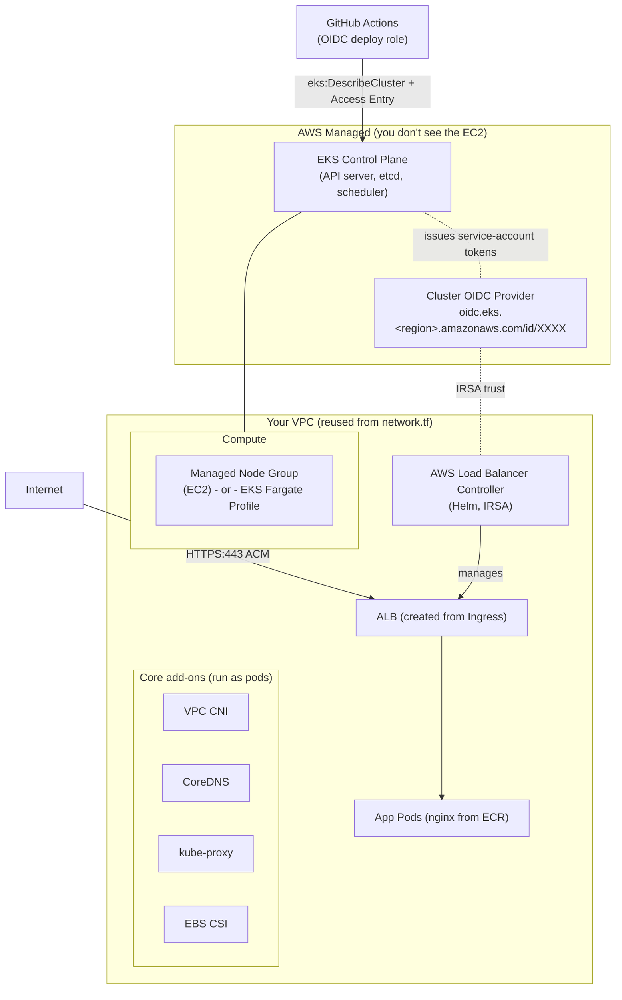

# 03 - Deploy the App to Amazon EKS (instead of ECS Fargate)

> This guide explains how to deploy the **same containerized nginx app** from
> `cicd-ecs-security-E2E` to **Amazon EKS (Kubernetes)** instead of **ECS Fargate**,
> while **reusing as much of the existing lab as possible**: the per-env ECR repos,
> the GitHub Actions + OIDC pipeline, the dev/qa/prod model, ACM TLS, and Route 53.
>
> The goal is not "throw away ECS and start over." It is "swap the runtime, keep the
> CI/CD spine." Most of the repo (`network.tf`, `ecr.tf`, the OIDC roles in `iam.tf`,
> the GitHub wiring in `github.tf`, the `build-and-scan` job) stays. The ECS service
> (`modules/ecs-env/main.tf`) and the **deploy** job are what actually change.

**Sections in this guide:** 1. ECS vs EKS decision · 2. EKS architecture · 3. Provision EKS with Terraform · 4. Per-environment strategy · 5. Kubernetes manifests · 6. ECS→EKS mapping · 7. Pipeline changes · 8. GitOps alternative · 9. Migration & teardown · 10. Production readiness checklist

---

## What stays vs. what changes (the 10-second answer)

| Concern | Today (ECS) | On EKS | Change? |
|---|---|---|---|
| VPC / subnets | `network.tf` (public subnets, IGW) | Same VPC, **subnets need ELB discovery tags** | ✅ mostly reused, add tags |
| Image registry | `ecr.tf` - 3 per-env ECR repos | **Identical** | ⬜ no change |
| GitHub OIDC provider | `iam.tf` `aws_iam_openid_connect_provider.github` | **Identical** | ⬜ no change |
| Per-env deploy roles | `iam.tf` `aws_iam_role.deploy` (per env) | Same roles, **swap ECS perms → `eks:DescribeCluster`**, map into cluster | 🔁 edit IAM policy |
| Repo / branches / env gates | `github.tf` | **Identical** (approvals, semver, branch protection) | ⬜ no change |
| `build-and-scan` job | `repo-seed/.github/workflows/ci-cd.yml` | **Identical** (build → scan → push to ECR) | ⬜ no change |
| Compute runtime | `aws_ecs_cluster` + service + task def | EKS cluster + node group / Fargate profile | 🔁 replace module |
| App definition | ECS task def (JSON in HCL) | K8s `Deployment` + `Service` + `Ingress` | 🔁 manifests |
| Load balancer | `aws_lb` + TG + listeners (in Terraform) | **AWS Load Balancer Controller** creates ALB from `Ingress` | 🔁 controller-managed |
| DNS | `aws_route53_record` (alias to ALB) | ExternalDNS **or** a manual alias record | 🔁 ExternalDNS recommended |
| Deploy job | `amazon-ecs-deploy-task-definition` | `aws eks update-kubeconfig` + `kubectl`/`kustomize` | 🔁 rewrite deploy job |

---

## 1. ECS vs EKS: the decision

Both run your container on AWS, both can run "serverless" on Fargate, both integrate
with ALB/ACM/Route 53/CloudWatch/IAM. The difference is **how much platform you own**.

| Dimension | **ECS (Fargate)** | **EKS (Kubernetes)** |
|---|---|---|
| Operational overhead | **Low.** AWS-proprietary, few moving parts. No control plane to reason about, no add-ons to upgrade. | **Higher.** You manage cluster version upgrades, add-ons (CNI/CoreDNS/CSI), controllers, RBAC, and node lifecycle. |
| Learning curve | Small. Task def + service + a couple of IAM roles. | Steeper. Pods, Deployments, Services, Ingress, RBAC, IRSA, Helm, kustomize. |
| Ecosystem | AWS-native only. | **Huge.** Helm charts, Operators, Argo/Flux, Istio/Linkerd, Prometheus, KEDA, Karpenter, etc. |
| Portability | Locked to AWS. Task defs don't move. | **Portable.** Manifests run on any conformant Kubernetes (GKE, AKS, on-prem). |
| Multi-cloud / hybrid | No. | Yes (the main reason teams pick it). |
| Cost (control plane) | $0 - no control plane charge. | **~$0.10/hr (~$73/mo) per cluster** for the managed control plane, on top of compute. |
| Cost (compute) | Fargate per-vCPU/GB. | Node groups (EC2, cheapest at scale) **or** EKS Fargate (per-pod, like ECS Fargate). |
| Autoscaling | Service Auto Scaling (target tracking). | HPA + Cluster Autoscaler / **Karpenter** (best-in-class). |
| Right tool when… | Small/medium AWS-only workloads, small team, you want shipping > platform-building. | Many teams/services, multi-cloud, you already know K8s, you need the CNCF ecosystem or advanced scheduling. |

**Honest summary:** for *this lab* (one nginx app, three environments), **ECS is the
simpler and cheaper choice** - that is exactly why the repo uses it. **EKS is more
powerful and portable**, and is worth it when you have a *fleet* of services, a team
that speaks Kubernetes, or a hard requirement for portability/CNCF tooling. Don't move
to EKS for prestige; move for portability, ecosystem, or scale.

> ⚠️ **Pitfall - the control-plane bill.** EKS charges per *cluster-hour* even when
> idle. Three clusters (one per env) = ~$220/mo before a single pod runs. For a lab,
> prefer **one cluster with three namespaces** (see §4).

---

## 2. EKS architecture



### Managed control plane
AWS runs the Kubernetes **control plane** (API server, etcd, scheduler, controller
manager) across multiple AZs. You never SSH into it; you talk to it via the
**Kubernetes API endpoint** with `kubectl`. AWS handles its HA and patching; **you
trigger the version upgrades** (e.g. 1.29 → 1.30 → 1.31).

### Compute options (where your pods actually run)

| Option | What it is | Use when |
|---|---|---|
| **Managed node groups** | AWS-managed EC2 instances (Auto Scaling Group) joined to the cluster. | Default for most clusters; cheapest at steady scale; supports DaemonSets, GPUs, etc. |
| **EKS Fargate profiles** | Serverless pods (no nodes to manage), matched by namespace/labels. Closest to the ECS-Fargate feel. | Want "no nodes," bursty/low-density workloads, or strong pod isolation. |
| **Karpenter** | Open-source just-in-time node autoscaler; provisions right-sized nodes in seconds. | Production at scale; replaces Cluster Autoscaler. Overkill for a lab. |

> For the lab, a **small managed node group (2× `t3.small`/`t3.medium`)** is the most
> straightforward. If you want the "serverless like ECS Fargate" experience, use a
> **Fargate profile** for the app namespaces instead - note its caveats below.

> ⚠️ **Pitfall - Fargate + DaemonSets + EBS.** EKS Fargate **can't run DaemonSets**
> and **can't mount EBS** (use EFS). The AWS LB Controller and CoreDNS still work, but
> anything that assumes a node-level agent won't. If you go Fargate-only you must also
> ensure CoreDNS is patched to run on Fargate.

### Core add-ons (every cluster needs these)

| Add-on | Job |
|---|---|
| **VPC CNI** (`aws-node`) | Gives each pod a real VPC IP (ENI). This is why `target-type: ip` works directly with the ALB. |
| **CoreDNS** | In-cluster DNS (`my-svc.my-ns.svc.cluster.local`). |
| **kube-proxy** | Service networking / iptables (ClusterIP routing). |
| **EBS CSI driver** | PersistentVolumes on EBS (not needed for stateless nginx, but standard). |

Install these as **EKS Managed Add-ons** so AWS handles compatible versioning.

### IRSA and EKS Pod Identity (giving pods AWS permissions)

A pod is **not** an EC2 instance, so it doesn't automatically have an IAM role. Two
ways to grant AWS permissions to a pod:

- **IRSA (IAM Roles for Service Accounts)** - the established mechanism. The cluster
  publishes an **OIDC provider**; you create an IAM role whose trust policy federates
  that OIDC provider and is scoped to a specific **`namespace:serviceaccount`**. You
  annotate the K8s ServiceAccount with the role ARN. Pods using that SA get temporary
  AWS creds via the projected token. **This is the same OIDC-federation pattern the
  repo already uses for GitHub Actions** - just a different OIDC issuer.
- **EKS Pod Identity** - newer (2024+), simpler. An `eks-pod-identity-agent` add-on
  plus an **association** mapping `namespace + serviceaccount → IAM role`. No per-role
  trust-policy editing, no OIDC thumbprint juggling, and it works across clusters
  without re-federating each one.

> For new clusters in 2025-2026, **EKS Pod Identity is the friendlier default**.
> IRSA remains widely used and is required by some Helm charts (the AWS LB Controller
> chart documents both). This guide shows **IRSA for the LB Controller** (most charts
> still assume it) and notes Pod Identity as the alternative.

### The cluster OIDC provider (don't confuse it with the GitHub one)
There are now **two** OIDC providers in play:

1. `token.actions.githubusercontent.com` - lets **GitHub Actions** assume AWS roles
   (already in `iam.tf`). **Unchanged.**
2. `oidc.eks.<region>.amazonaws.com/id/<hash>` - lets **pods inside this cluster**
   assume AWS roles via IRSA. **New**, created when you enable IRSA on the cluster.

---

## 3. Provision EKS with Terraform

Use the community **[`terraform-aws-modules/eks/aws`](https://github.com/terraform-aws-modules/terraform-aws-eks)** module (v20.x). It builds the
cluster, node group/Fargate profile, enables the OIDC provider, and wires managed
add-ons. We **reuse the existing VPC/subnets** from `network.tf`.

> ⚠️ **Pitfall - public subnets only.** The repo's `network.tf` creates **public
> subnets only** (Fargate-with-public-IP, no NAT). EKS works with public subnets, but
> production usually puts **nodes in private subnets** and only the ALB in public ones.
> For the lab, public subnets are fine; for prod, add private subnets + NAT.

### 3a. Tag the subnets for ELB discovery
The AWS Load Balancer Controller **auto-discovers** which subnets to place the ALB in
by reading tags. Add these to the subnets in `network.tf`:

```hcl
# network.tf - add to aws_subnet.public.tags
resource "aws_subnet" "public" {
  # ...existing config...
  tags = {
    Name                                = "${var.repo_name}-public-${count.index}"
    # Cluster discovery (one or more clusters can share a subnet):
    "kubernetes.io/cluster/${var.repo_name}" = "shared"
    # Public ALBs go in subnets tagged elb:
    "kubernetes.io/role/elb"            = "1"
  }
}
# Private subnets (if you add them) get "kubernetes.io/role/internal-elb" = "1".
```

> ⚠️ **Pitfall - missing subnet tags = "no subnets found."** The single most common
> Ingress failure on EKS is the controller logging `couldn't auto-discover subnets`.
> It means the `kubernetes.io/role/elb` (or `internal-elb`) tag is missing. Either tag
> the subnets or set `alb.ingress.kubernetes.io/subnets` explicitly on the Ingress.

### 3b. The cluster + compute (managed node group)

```hcl
# eks.tf - new file in the repo root

module "eks" {
  source  = "terraform-aws-modules/eks/aws"
  version = "~> 20.0"

  cluster_name    = var.repo_name
  cluster_version = "1.31"             # EKS 1.29+ (current/supported in 2025-2026)

  # Reuse the repo's VPC + subnets (network.tf).
  vpc_id     = aws_vpc.this.id
  subnet_ids = aws_subnet.public[*].id

  # Public API endpoint so GitHub Actions runners can reach it (lab).
  # Lock this down / use private endpoint + access for production.
  cluster_endpoint_public_access = true

  # Enable the cluster OIDC provider (powers IRSA).
  enable_irsa = true

  # Managed core add-ons - AWS keeps versions compatible with the cluster.
  cluster_addons = {
    coredns                = {}
    kube-proxy             = {}
    vpc-cni                = { before_compute = true } # CNI before nodes join
    aws-ebs-csi-driver     = {}
    eks-pod-identity-agent = {}  # enables Pod Identity (optional alongside IRSA)
  }

  # ---- Option A: managed node group (recommended for the lab) ----
  eks_managed_node_groups = {
    default = {
      instance_types = ["t3.medium"]
      min_size       = 2
      max_size       = 4
      desired_size   = 2
    }
  }

  # ---- Option B: EKS Fargate (serverless, "ECS-Fargate-like") ----
  # Comment out the node group above and use this instead:
  # fargate_profiles = {
  #   app = {
  #     selectors = [
  #       { namespace = "dev" }, { namespace = "qa" }, { namespace = "prod" },
  #       { namespace = "kube-system" }, # so CoreDNS can run on Fargate
  #     ]
  #   }
  # }

  # Use EKS Access Entries (not aws-auth) for IAM->cluster mapping (see §7).
  authentication_mode = "API_AND_CONFIG_MAP"

  enable_cluster_creator_admin_permissions = true # whoever runs `terraform apply`
}
```

### 3c. Install the AWS Load Balancer Controller (Helm + IRSA)
This controller watches `Ingress`/`Service type=LoadBalancer` objects and creates real
ALBs/NLBs. It needs AWS permissions, granted via **IRSA**.

```hcl
# alb-controller.tf

# IRSA role with the documented LB-controller policy, scoped to its service account.
module "lb_controller_irsa" {
  source  = "terraform-aws-modules/iam/aws//modules/iam-role-for-service-accounts-eks"
  version = "~> 5.0"

  role_name                              = "${var.repo_name}-alb-controller"
  attach_load_balancer_controller_policy = true # bundled, up-to-date policy

  oidc_providers = {
    main = {
      provider_arn               = module.eks.oidc_provider_arn
      namespace_service_accounts = ["kube-system:aws-load-balancer-controller"]
    }
  }
}

resource "helm_release" "alb_controller" {
  name       = "aws-load-balancer-controller"
  repository = "https://aws.github.io/eks-charts"
  chart      = "aws-load-balancer-controller"
  namespace  = "kube-system"
  version    = "1.10.0" # chart for controller v2.x (check latest)

  set {
    name  = "clusterName"
    value = module.eks.cluster_name
  }
  set { name = "serviceAccount.create" value = "true" }
  set {
    name  = "serviceAccount.name"
    value = "aws-load-balancer-controller"
  }
  set {
    name  = "serviceAccount.annotations.eks\\.amazonaws\\.com/role-arn"
    value = module.lb_controller_irsa.iam_role_arn
  }
  depends_on = [module.eks]
}
```

```hcl
# providers.tf - add Helm + Kubernetes providers wired to the new cluster
data "aws_eks_cluster_auth" "this" { name = module.eks.cluster_name }

provider "kubernetes" {
  host                   = module.eks.cluster_endpoint
  cluster_ca_certificate = base64decode(module.eks.cluster_certificate_authority_data)
  token                  = data.aws_eks_cluster_auth.this.token
}
provider "helm" {
  kubernetes {
    host                   = module.eks.cluster_endpoint
    cluster_ca_certificate = base64decode(module.eks.cluster_certificate_authority_data)
    token                  = data.aws_eks_cluster_auth.this.token
  }
}
```

> ⚠️ **Pitfall - `set` is deprecated in newer Helm provider.** In `hashicorp/helm`
> provider **v3**, the `set { name … value … }` block is replaced by a top-level
> `set = [{ name = …, value = … }]` attribute. Match the syntax to your provider
> version or the plan will error.

> ⚠️ **Pitfall - controller version vs. cluster version.** The AWS LB Controller
> **v2.x** chart must be compatible with your EKS version. Always check the
> compatibility matrix in the chart's docs before bumping either side.

---

## 4. Per-environment strategy on EKS

| Strategy | Pros | Cons |
|---|---|---|
| **One cluster, namespaces** `dev`/`qa`/`prod` | One control plane (one ~$73/mo bill), one set of add-ons, simplest ops. Matches this lab's spirit. | Weaker isolation (shared control plane, node pool, network policies needed for hard separation); a bad cluster upgrade hits all envs. |
| **Cluster per environment** | Strong blast-radius isolation; prod upgrade can't break dev; per-env IAM/network boundaries. | 3× control-plane cost, 3× add-on upgrades, 3× toil. |

**Recommendation for the lab: one cluster, three namespaces** (`dev`, `qa`, `prod`).
It mirrors the existing per-env model cheaply. Use **namespaces + ResourceQuotas +
NetworkPolicies + per-namespace RBAC** to approximate isolation. For real production
with strict compliance/blast-radius needs, **cluster-per-env** (or at least
prod-separate) is the safer call.

> ⚠️ **Pitfall - "namespace" ≠ "isolation."** Namespaces are a *naming/RBAC* boundary,
> not a security boundary by default. Without **NetworkPolicies**, pods in `dev` can
> reach pods in `prod`. Add a default-deny NetworkPolicy per namespace if isolation
> matters.

---

## 5. Kubernetes manifests for the app

These replace the ECS task def + service + ALB (`modules/ecs-env/main.tf`). We use
**kustomize overlays**: a shared `base/` plus per-env `overlays/{dev,qa,prod}/`.

### Directory layout
```
k8s/
├── base/
│   ├── kustomization.yaml
│   ├── deployment.yaml
│   ├── service.yaml
│   ├── ingress.yaml
│   ├── hpa.yaml
│   └── serviceaccount.yaml
└── overlays/
    ├── dev/  { kustomization.yaml, patches }
    ├── qa/   { kustomization.yaml, patches }
    └── prod/ { kustomization.yaml, patches }
```

### `base/deployment.yaml`
```yaml
apiVersion: apps/v1
kind: Deployment
metadata:
  name: app
  labels: { app: app }
spec:
  replicas: 1                      # overlays bump prod; HPA takes over at runtime
  selector:
    matchLabels: { app: app }
  template:
    metadata:
      labels: { app: app }
    spec:
      serviceAccountName: app      # IRSA SA (only matters if the app needs AWS)
      containers:
        - name: app                # == CONTAINER_NAME (vars.CONTAINER_NAME)
          image: PLACEHOLDER_IMAGE # kustomize/kubectl set-image overwrites this
          ports:
            - containerPort: 80
          readinessProbe:
            httpGet: { path: /, port: 80 }
          livenessProbe:
            httpGet: { path: /, port: 80 }
          resources:
            requests: { cpu: 100m, memory: 128Mi }
            limits:   { cpu: 500m, memory: 256Mi }
```

### `base/service.yaml` (ClusterIP - the ALB targets pods directly)
```yaml
apiVersion: v1
kind: Service
metadata:
  name: app
spec:
  type: ClusterIP
  selector: { app: app }
  ports:
    - port: 80
      targetPort: 80
```

### `base/ingress.yaml` (ALB via the LB Controller, ACM TLS, ssl-redirect)
```yaml
apiVersion: networking.k8s.io/v1
kind: Ingress
metadata:
  name: app
  annotations:
    kubernetes.io/ingress.class: alb
    alb.ingress.kubernetes.io/scheme: internet-facing
    alb.ingress.kubernetes.io/target-type: ip            # pods directly (VPC CNI)
    alb.ingress.kubernetes.io/listen-ports: '[{"HTTP":80},{"HTTPS":443}]'
    alb.ingress.kubernetes.io/ssl-redirect: '443'        # 80 -> 443 (HTTP_301)
    alb.ingress.kubernetes.io/certificate-arn: PLACEHOLDER_ACM_ARN
    alb.ingress.kubernetes.io/healthcheck-path: /
    # Optional: let ExternalDNS create the Route53 record from this host:
    # external-dns.alpha.kubernetes.io/hostname: dev.example.com
spec:
  rules:
    - host: PLACEHOLDER_FQDN     # e.g. dev.example.com - set per overlay
      http:
        paths:
          - path: /
            pathType: Prefix
            backend:
              service:
                name: app
                port: { number: 80 }
```

This single Ingress reproduces the entire ECS LB stack: `aws_lb` + `aws_security_group`
+ `aws_lb_target_group` + the HTTP→HTTPS redirect listener + the HTTPS listener with
the ACM cert. The controller builds all of it.

### `base/hpa.yaml` (replaces ECS Service Auto Scaling)
```yaml
apiVersion: autoscaling/v2
kind: HorizontalPodAutoscaler
metadata:
  name: app
spec:
  scaleTargetRef: { apiVersion: apps/v1, kind: Deployment, name: app }
  minReplicas: 1
  maxReplicas: 5
  metrics:
    - type: Resource
      resource:
        name: cpu
        target: { type: Utilization, averageUtilization: 70 }
```
> ⚠️ **Pitfall - HPA needs metrics-server.** The HPA reads CPU/memory from the
> **metrics-server** add-on, which is **not installed by default** on EKS. Install it
> (Helm chart `metrics-server`) or the HPA stays `<unknown>` and never scales.

### `base/serviceaccount.yaml` (IRSA - only if the app calls AWS)
nginx serving static HTML needs **no** AWS access, so this SA can be plain. Shown for
completeness if the app later needs S3/Secrets Manager/etc.
```yaml
apiVersion: v1
kind: ServiceAccount
metadata:
  name: app
  annotations:
    # Set only if the app needs AWS perms (created via an IRSA role like §3c):
    eks.amazonaws.com/role-arn: PLACEHOLDER_APP_IRSA_ROLE_ARN
```

### `base/kustomization.yaml`
```yaml
apiVersion: kustomize.config.k8s.io/v1beta1
kind: Kustomization
resources:
  - serviceaccount.yaml
  - deployment.yaml
  - service.yaml
  - ingress.yaml
  - hpa.yaml
```

### `overlays/dev/kustomization.yaml` (one per env)
```yaml
apiVersion: kustomize.config.k8s.io/v1beta1
kind: Kustomization
namespace: dev                     # the env namespace (created separately, see below)
resources:
  - ../../base
  - namespace.yaml
images:
  - name: PLACEHOLDER_IMAGE        # the pipeline overrides the tag at deploy time
    newName: ACCOUNT.dkr.ecr.REGION.amazonaws.com/cicd-ecs-security-E2E-dev
    newTag: latest
patches:
  - target: { kind: Ingress, name: app }
    patch: |
      - op: replace
        path: /spec/rules/0/host
        value: dev.example.com
      - op: replace
        path: /metadata/annotations/alb.ingress.kubernetes.io~1certificate-arn
        value: PLACEHOLDER_ACM_ARN
  # prod overlay also bumps replicas / HPA max and uses the prod ECR repo + host.
```
`overlays/dev/namespace.yaml`:
```yaml
apiVersion: v1
kind: Namespace
metadata: { name: dev }
```
> The `qa` and `prod` overlays are identical except `namespace`, the `host`
> (`qa.example.com` / `example.com`), the ECR repo name (`…-qa` / `…-prod`), and prod's
> higher `replicas`/HPA bounds - exactly the per-env knobs the ECS lab parameterizes.

### Route 53: ExternalDNS vs. manual alias
- **ExternalDNS (recommended):** deploy the ExternalDNS controller (its own IRSA role
  with `route53:ChangeResourceRecordSets` scoped to your hosted zone). It watches
  Ingresses and **creates/updates the Route 53 alias records automatically** from the
  `host`. This replaces `aws_route53_record` in `modules/ecs-env/main.tf` and keeps DNS
  in lockstep with deploys.
- **Manual alias (simplest):** keep a Terraform `aws_route53_record` per env pointing
  at the ALB. The catch: the ALB DNS name isn't known until the Ingress reconciles, so
  you'd read it back (e.g. via a data source on the controller-created LB) - clunkier
  than ExternalDNS.

> ⚠️ **Pitfall - ExternalDNS ownership.** Give ExternalDNS a `txtOwnerId` and a
> hosted-zone filter so it only manages records it created. Without that it can fight
> other controllers (or your Terraform) over the same records.

---

## 6. ECS → EKS equivalents

| ECS concept (this repo) | Where it lives today | EKS / Kubernetes equivalent |
|---|---|---|
| ECS **cluster** (`aws_ecs_cluster`) | `modules/ecs-env/main.tf` | A **Namespace** in one EKS cluster (`dev`/`qa`/`prod`) |
| ECS **service** (`aws_ecs_service`) | `modules/ecs-env/main.tf` | **Deployment** (+ its ReplicaSet) |
| **Task definition** (container def JSON) | `aws_ecs_task_definition` | **Pod spec** inside the Deployment template |
| `desired_count` | service arg | Deployment `replicas` (+ **HPA**) |
| **ALB + TG + listeners + SGs** | `aws_lb`, `aws_lb_target_group`, `aws_lb_listener` | **Ingress** reconciled by the **AWS Load Balancer Controller** |
| HTTP→HTTPS redirect listener | `aws_lb_listener.http` | `alb.ingress.kubernetes.io/ssl-redirect: '443'` |
| ACM cert on HTTPS listener | `certificate_arn` on listener | `alb.ingress.kubernetes.io/certificate-arn` |
| `target_type = "ip"` (awsvpc) | target group | `alb.ingress.kubernetes.io/target-type: ip` (VPC CNI) |
| **awslogs** driver → CloudWatch | task def `logConfiguration` | stdout/stderr → container logs; ship via **Fluent Bit / CloudWatch Container Insights** |
| **Execution role** (pull image, write logs) | `aws_iam_role.ecs_execution` | Node's IAM role (managed node group) / pod execution role (Fargate) - handled by the EKS module |
| **Task role** (app's AWS perms) | (not used here) | **ServiceAccount + IRSA / Pod Identity** |
| **Route 53 record** (alias→ALB) | `aws_route53_record` | **ExternalDNS** (or a manual alias record) |
| Per-env **ECR repo** | `ecr.tf` | **Unchanged** - same per-env ECR repos |
| Service Auto Scaling | (n/a here) | **HorizontalPodAutoscaler** (+ Cluster Autoscaler/Karpenter for nodes) |

---

## 7. Pipeline changes (GitHub Actions)

**`build-and-scan` stays byte-for-byte the same:** it still builds the image, runs
Sonar/Snyk, maps branch→env, computes the semver/SHA tag, and pushes to the **per-env
ECR repo** using the **per-env OIDC role**. None of that is ECS-specific.

**Only the `deploy` job changes.** Instead of `amazon-ecs-deploy-task-definition`, it:
1. assumes the env's OIDC role,
2. runs `aws eks update-kubeconfig`,
3. applies the kustomize overlay (or `kubectl set image`).

### 7a. IAM changes (`iam.tf`)
Swap the ECS statements in `data.aws_iam_policy_document.deploy` for EKS. The ECR push
and `GetAuthorizationToken` statements **stay** (the build job still pushes images).

```hcl
# iam.tf - replace the "EcsDeploy" + "PassExecutionRole" statements with:
statement {
  sid       = "EksDescribe"
  effect    = "Allow"
  actions   = ["eks:DescribeCluster"]            # needed by update-kubeconfig
  resources = [module.eks.cluster_arn]
}
# Keep EcrAuth + EcrPushPull exactly as-is (build job still needs them).
```

> Permission to *call the Kubernetes API* is **not** an IAM thing - it's granted
> **inside the cluster** (next step). `eks:DescribeCluster` only lets the runner fetch
> the endpoint/CA to build a kubeconfig.

### 7b. Map the GitHub deploy role **into** the cluster
Two ways; **EKS Access Entries are preferred** (API-driven, no ConfigMap editing,
supported natively by the EKS module via `authentication_mode = "API_AND_CONFIG_MAP"`).

**Preferred - Access Entries (Terraform):**
```hcl
# eks.tf - grant each env's deploy role rights, scoped to that env namespace.
module "eks" {
  # ...
  access_entries = {
    for env, cfg in var.environments : env => {
      principal_arn = aws_iam_role.deploy[env].arn
      policy_associations = {
        admin = {
          policy_arn = "arn:aws:eks::aws:cluster-access-policy/AmazonEKSEditPolicy"
          access_scope = {
            type       = "namespace"
            namespaces = [env]   # dev role -> dev namespace only, etc.
          }
        }
      }
    }
  }
}
```
This preserves the lab's **least-privilege-per-env** property: the dev pipeline can
only touch the `dev` namespace, never `prod`.

**Alternative - `aws-auth` ConfigMap (legacy):**
```yaml
# Map IAM role ARNs to Kubernetes groups (then bind groups via RBAC).
apiVersion: v1
kind: ConfigMap
metadata: { name: aws-auth, namespace: kube-system }
data:
  mapRoles: |
    - rolearn: arn:aws:iam::ACCOUNT:role/cicd-ecs-security-E2E-dev-deploy
      username: gha-dev
      groups: [ "dev-deployers" ]   # bind via a Role/RoleBinding in the dev namespace
```
> ⚠️ **Pitfall - `aws-auth` is a single shared object.** One malformed edit can lock
> **everyone** out of the cluster. Access Entries are per-principal and far safer -
> prefer them on EKS 1.29+.

### 7c. The new `deploy` job
```yaml
  deploy:
    needs: build-and-scan
    if: github.event_name == 'push'
    runs-on: ubuntu-latest
    # SAME approval gates: branch -> GitHub environment (prod has reviewers/wait timer).
    environment: ${{ github.ref_name == 'main' && 'prod' || github.ref_name }}
    permissions:
      contents: read
      id-token: write
    env:
      EKS_CLUSTER: cicd-ecs-security-E2E
      NAMESPACE: ${{ github.ref_name == 'main' && 'prod' || github.ref_name }}
    steps:
      - uses: actions/checkout@v4

      - name: Configure AWS credentials (OIDC, env-scoped role)
        uses: aws-actions/configure-aws-credentials@v4
        with:
          role-to-assume: ${{ vars.AWS_ROLE_ARN }}   # unchanged: env-scoped deploy role
          aws-region: ${{ vars.AWS_REGION }}

      - name: Update kubeconfig
        run: aws eks update-kubeconfig --name "$EKS_CLUSTER" --region "${{ vars.AWS_REGION }}"

      # --- Option 1: kustomize overlay (full manifest apply) ---
      - name: Deploy with kustomize
        run: |
          cd k8s/overlays/${{ env.NAMESPACE }}
          kustomize edit set image PLACEHOLDER_IMAGE=${{ needs.build-and-scan.outputs.image }}
          kustomize build . | kubectl apply -f -
          kubectl -n "$NAMESPACE" rollout status deployment/app --timeout=180s

      # --- Option 2: fast image-only roll (equivalent to ECS new task def) ---
      # - name: Roll new image
      #   run: |
      #     kubectl -n "$NAMESPACE" set image deployment/app \
      #       app=${{ needs.build-and-scan.outputs.image }}
      #     kubectl -n "$NAMESPACE" rollout status deployment/app --timeout=180s

      # --- Option 3: Helm (if you package the app as a chart) ---
      # - run: helm upgrade --install app ./chart -n "$NAMESPACE" \
      #          --set image.repository=...,image.tag=${{ needs.build-and-scan.outputs.version }} --wait
```
**Unchanged from ECS:** the environment-gate mapping (`main`→`prod`), prod semver
tagging in `build-and-scan`, the per-env role ARN in `vars.AWS_ROLE_ARN`,
branch protection. The per-env GitHub variables `ECS_CLUSTER/ECS_SERVICE/
ECS_TASK_FAMILY` in `github.tf` get **replaced** by `EKS_CLUSTER` + `NAMESPACE`
variables.

> ⚠️ **Pitfall - runner can't reach a private API endpoint.** GitHub-hosted runners
> are on the public internet. If you set the cluster endpoint to **private-only**,
> `update-kubeconfig` will succeed but `kubectl` will time out. For the lab keep the
> endpoint public (optionally IP-allowlisted); for prod use **self-hosted runners in
> the VPC** or a private networking path.

> ⚠️ **Pitfall - `rollout status` is your gate.** ECS had
> `wait-for-service-stability: true`. The K8s equivalent is
> `kubectl rollout status` - keep it so a bad image **fails the job** instead of
> silently leaving crash-looping pods.

---

## 8. GitOps alternative (recommended for Kubernetes)

The deploy job above is **push-based**: CI holds cluster credentials and runs
`kubectl apply`. A more K8s-native pattern is **GitOps (pull-based)**: a controller
**inside** the cluster (**Argo CD** or **Flux**) watches a Git repo/branch and
continuously reconciles the cluster to match it.

**How it changes the flow:** `build-and-scan` pushes the image **and** commits the new
tag into the manifests repo (e.g. `kustomize edit set image …` → commit). The cluster
controller notices and rolls out. CI never touches the cluster.

| | **Push (`kubectl` in CI)** | **GitOps (Argo CD / Flux)** |
|---|---|---|
| Cluster creds | Live in GitHub (OIDC role mapped in) | **Never leave the cluster** |
| Source of truth | The pipeline run | **Git** (declarative, auditable) |
| Drift handling | None - manual `kubectl` edits persist | **Auto-corrected** to match Git |
| Rollback | Re-run pipeline | `git revert` (or Argo UI) |
| Setup cost | Low (just the deploy job) | Higher (install + bootstrap controller) |
| Approval gates | GitHub Environments (already have these) | Git PR review **+** Argo sync windows |

**For this lab:** start with the push-based `kubectl` job (least change, keeps the
existing approval gates working as-is). **Graduate to Argo CD** once you have multiple
services - it scales far better and removes cluster creds from CI. Argo's
`ApplicationSet` maps cleanly onto the dev/qa/prod overlays (one Application per
namespace), and you keep GitHub Environment approvals on the **image-bump PR**.

---

## 9. Migration steps (ECS → EKS) and teardown

### Migration
1. **Add subnet ELB tags** to `network.tf` (§3a); `terraform apply`.
2. **Add `eks.tf` + `alb-controller.tf`** and the Kubernetes/Helm providers (§3);
   `terraform apply` to create the cluster, node group, add-ons, and LB controller.
3. **Install metrics-server** (for HPA) and, if using it, **ExternalDNS** (with its
   IRSA role scoped to the hosted zone).
4. **Edit `iam.tf`**: swap the ECS deploy statements for `eks:DescribeCluster`; keep
   ECR statements (§7a). Add **Access Entries** mapping each env deploy role to its
   namespace (§7b).
5. **Add the `k8s/` kustomize tree** (base + overlays) to the repo (§5).
6. **Update the workflow's `deploy` job** to the EKS version (§7c). Replace the
   `ECS_*` GitHub variables in `github.tf` with `EKS_CLUSTER`/`NAMESPACE`.
7. **Deploy via the pipeline.** Verify ALBs come up (`kubectl get ingress -A`), DNS
   resolves, HTTPS works, and `rollout status` passes in each env.
8. **Cut over DNS** (if you ran ECS and EKS in parallel, switch the Route 53 records
   from the old ALB to the new Ingress-created ALB, then drain).
9. **Decommission ECS**: remove `module "env"` (the `ecs-env` module) and
   `aws_iam_role.ecs_execution` from `main.tf`/`iam.tf`; `terraform apply`.

> ⚠️ **Pitfall - order of teardown.** Delete the **Kubernetes Ingresses first** (so
> the LB Controller deletes the ALBs it created) **before** `terraform destroy`.
> Otherwise the controller-managed ALBs/target groups/SGs are orphaned and the VPC
> destroy fails with "DependencyViolation."

### Teardown
```bash
kubectl delete ingress --all -A          # let the controller remove its ALBs
kubectl delete svc --all -A --field-selector spec.type=LoadBalancer
# wait for the LBs to disappear in the console, then:
terraform destroy
```
The per-env ECR repos use `force_delete = true`, so images don't block destroy.

---

## 10. EKS production readiness checklist

**Cluster & networking**
- [ ] Nodes in **private subnets** + NAT; only ALBs in public subnets.
- [ ] API endpoint **private** (or public + tight IP allowlist) - not wide-open.
- [ ] Subnets correctly tagged (`kubernetes.io/role/elb` / `internal-elb`,
      `kubernetes.io/cluster/<name>`).
- [ ] Multi-AZ node groups; PodDisruptionBudgets on critical workloads.
- [ ] A clear **cluster version upgrade** runbook (1.29 → 1.30 → 1.31, one minor at a time).

**Identity & access**
- [ ] **IRSA / Pod Identity** for every pod that calls AWS - no node-wide creds.
- [ ] **Access Entries** (not `aws-auth`) for IAM→cluster mapping, least-privilege per env.
- [ ] Namespace-scoped RBAC; CI deploy role limited to its own namespace.

**Workload health**
- [ ] **metrics-server** installed; HPAs defined with sane min/max.
- [ ] **Resource requests/limits** set on every container.
- [ ] Liveness/readiness/startup probes on all app pods.
- [ ] Cluster autoscaling via **Karpenter** or Cluster Autoscaler.

**Observability**
- [ ] **Container Insights / Fluent Bit** shipping logs + metrics to CloudWatch.
- [ ] Prometheus/Grafana (or AMP/AMG) for cluster + app metrics; alerting wired.

**Security & supply chain**
- [ ] Keep the existing **image scanning** (`scan_on_push`) + Snyk/Sonar gates.
- [ ] **Default-deny NetworkPolicies** per namespace; restrict egress.
- [ ] Pod Security Standards (restricted) / admission control (e.g. OPA/Kyverno).
- [ ] Secrets via **External Secrets Operator** + Secrets Manager (not plain K8s Secrets).
- [ ] ACM cert covers all env hostnames; **ssl-redirect** enforced on every Ingress.

**Delivery**
- [ ] `kubectl rollout status` (or Helm `--wait`) gates every deploy.
- [ ] Keep **GitHub Environment approval gates** + **prod semver tagging**.
- [ ] Consider **GitOps (Argo CD/Flux)** to remove cluster creds from CI.
- [ ] Documented rollback (kubectl rollout undo / `git revert` under GitOps).

---

### TL;DR
Keep `network.tf` (add tags), `ecr.tf`, the OIDC provider + per-env roles (swap ECS
perms for `eks:DescribeCluster` + Access Entries), `github.tf`'s repo/branch/env-gate
wiring, and the entire `build-and-scan` job. Replace the `ecs-env` module with an EKS
cluster (community module) + LB Controller, express the app as kustomize overlays
(Deployment/Service/Ingress/HPA per namespace), and change the **deploy** job to
`update-kubeconfig` + `kustomize|kubectl apply`. Same pipeline spine, Kubernetes
runtime.
