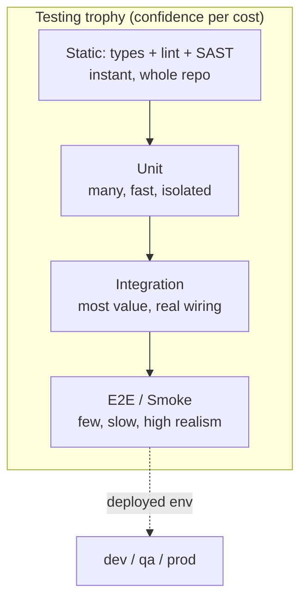
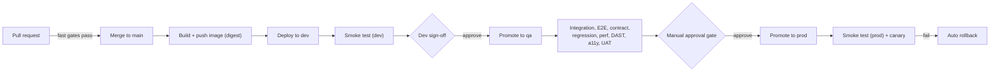

# Testing strategy and quality gates

This document is the testing and quality-gates reference for the **cicd-ecs-security-E2E** lab: a CI/CD + DevSecOps pipeline that builds containers, runs a layered test suite, and promotes through **dev -> qa -> prod** on AWS ECS Fargate via GitHub Actions.

The goal is simple: catch defects as early and as cheaply as possible (shift-left), but still run the slower, environment-dependent, and risk-based tests at the right gate before code reaches production.

> Conventions used here:
> - **Gate** = blocks the pipeline on failure (red = no merge / no promote).
> - **Warn** = reports a finding but does not block (used for noisy or maturing checks).
> - **Stage/environment** = where the test executes (PR runner, ephemeral env, `dev`, `qa`, `prod`).

---

## Table of contents

1. [The test pyramid and the testing trophy](#1-the-test-pyramid-and-the-testing-trophy)
2. [Where tests run in the flow](#2-where-tests-run-in-the-flow)
3. [Smoke tests](#3-smoke-tests)
4. [Tests after dev sign-off (promotion gates)](#4-tests-after-dev-sign-off-promotion-gates)
5. [Browser / functional testing frameworks](#5-browser--functional-testing-frameworks)
6. [Dynamic security testing (DAST)](#6-dynamic-security-testing-dast)
7. [Load / performance testing frameworks](#7-load--performance-testing-frameworks)
8. [API testing](#8-api-testing)
9. [Coverage and quality gates](#9-coverage-and-quality-gates)
10. [What to gate vs warn, and a testing checklist](#10-what-to-gate-vs-warn-and-a-testing-checklist)

---

## 1. The test pyramid and the testing trophy

### The classic test pyramid

The pyramid (Mike Cohn) says: have **many fast, cheap unit tests** at the bottom, **fewer integration tests** in the middle, and **very few slow, brittle end-to-end tests** at the top. The higher you go, the slower, flakier, and more expensive to maintain each test becomes, so you want fewer of them.

### The modern "testing trophy"

Kent C. Dodds' **testing trophy** reshapes the pyramid for modern apps (especially front-end and service code). It keeps a base of **static analysis** (types, lint, SAST) and puts the largest investment into **integration tests**, because integration tests give the best return: they exercise real wiring (modules, DB, HTTP) and are far less brittle than full UI E2E, while catching more real bugs than isolated unit tests. The guiding principle: *"The more your tests resemble the way your software is used, the more confidence they can give you."*

This lab blends both: a wide static + unit base on PRs, a strong integration/contract middle, and a thin, high-value E2E + smoke cap that runs against deployed environments.

### Rough ratios

These are heuristics, not laws. Tune to your risk profile.

| Layer | Pyramid target | Trophy emphasis | Speed | Typical scope |
|---|---|---|---|---|
| Static (types, lint, SAST) | implicit base | heavy | instant | whole codebase |
| Unit | ~70% | medium | ms | single function/class, mocked deps |
| Integration | ~20% | **heaviest** | ms-seconds | module + real DB/HTTP/queue |
| Contract | small, focused | medium | seconds | provider/consumer API shape |
| End-to-end | ~10% | thin | seconds-minutes | full system through the UI/API |

### Diagram



**Why this shape?** Static and unit tests run on every push in seconds and are nearly free. Integration tests catch the bugs that actually ship (serialization, SQL, auth, config). E2E and smoke are kept thin because they are slow and flaky, but they are the only tests that prove the *deployed* system works end to end.

---

## 2. Where tests run in the flow

The pipeline has three broad phases:

1. **PR gate (fast feedback):** runs on every pull request, must be quick (target under ~10 minutes). These block the merge.
2. **Pre-merge / merge-to-main + deploy to dev:** heavier tests plus the first real deploy and smoke test.
3. **Promotion (after dev sign-off):** qa-class and prod-readiness tests run when a human (or scheduled job) promotes the artifact `dev -> qa`, then `qa -> prod` behind a manual approval.

> Key principle: we promote the **same immutable image digest** through environments. We do not rebuild between stages, we only re-test and re-configure.

### Promotion flow



### Test-to-stage mapping

| Test type | PR gate | Merge -> deploy dev | After dev sign-off (qa) | Pre/post prod promote |
|---|---|---|---|---|
| Lint / format | Gate | - | - | - |
| Type check | Gate | - | - | - |
| Unit tests | Gate | re-run | - | - |
| SAST (code scan) | Gate | - | - | - |
| SCA (dependency scan) | Gate | - | re-scan (warn->gate on new CVEs) | re-scan |
| Secret scan | Gate | - | - | - |
| Integration tests | partial (mocked) | Gate (real deps in dev) | Gate (full) | - |
| Contract tests (Pact) | Gate (consumer) | publish + verify | provider verify | can-i-deploy check |
| Smoke tests | - | **Gate (immediately after deploy)** | Gate after qa deploy | **Gate after prod deploy** |
| E2E functional UI | nightly subset | - | Gate (full suite) | smoke subset |
| Regression suite | - | - | Gate | - |
| Performance / load | - | - | Gate (thresholds) | - |
| Stress / spike / soak | - | - | scheduled (warn) | soak post-deploy (warn) |
| DAST (ZAP baseline) | - | baseline on dev (warn) | **full scan (gate)** | baseline (warn) |
| Container image re-scan | build time (gate) | - | re-scan (gate) | re-scan |
| Accessibility (a11y) | component-level (warn) | - | Gate (WCAG critical) | - |
| Visual regression | PR (warn) | - | Gate on approved baselines | - |
| Chaos / resilience | - | - | scheduled in qa (warn) | game-day (manual) |
| UAT + manual approval | - | - | sign-off | **manual approval gate** |
| Pen test gate | - | - | scheduled / release-based | release sign-off |

---

## 3. Smoke tests

### What they are

A **smoke test** is a tiny, fast check (seconds, not minutes) run **immediately after every deploy** to confirm the application actually started, is reachable, and its critical paths respond. The name comes from hardware: power it on and see if smoke comes out. Smoke tests answer one question: *"Is this deploy alive enough to keep going?"*

They are **not** comprehensive. They are a fast tripwire so a broken deploy is caught in seconds and rolled back before users or the rest of the pipeline are affected.

### Why run them after every deploy

- The artifact passed all pre-deploy tests, but **config, secrets, networking, DNS, load balancer health checks, and IAM** are only real in the target environment.
- They gate promotion: a failed smoke test on `dev` stops the `qa` promotion; a failed smoke test on `prod` triggers rollback.
- They are cheap insurance against the most common production incident: "it deployed but it does not actually serve traffic."

### Typical smoke checks

| Check | Example | Pass criteria |
|---|---|---|
| HTTP health | `GET /healthz` | 200 within 2s |
| Readiness/deep health | `GET /readyz` (checks DB, cache) | 200, dependencies OK |
| Critical-path request | `GET /api/products` | 200, non-empty payload |
| Synthetic login | `POST /api/login` with a test account | 200, valid session/token |
| Version check | `GET /version` | matches the deployed image digest/sha |

### Real GitHub Actions smoke-test step (curl + k6) with rollback

```yaml
# .github/workflows/deploy.yml (excerpt)
  smoke:
    needs: deploy
    runs-on: ubuntu-latest
    env:
      BASE_URL: ${{ needs.deploy.outputs.service_url }}
    steps:
      - name: HTTP health check (curl, retry up to ~60s)
        run: |
          for i in $(seq 1 12); do
            code=$(curl -s -o /dev/null -w "%{http_code}" "$BASE_URL/healthz" || echo 000)
            echo "attempt $i -> $code"
            [ "$code" = "200" ] && exit 0
            sleep 5
          done
          echo "::error::Health check never returned 200"
          exit 1

      - name: Critical-path + synthetic login (k6 quick check)
        uses: grafana/setup-k6-action@v1
      - run: k6 run --quiet tests/smoke/smoke.js
        env:
          BASE_URL: ${{ env.BASE_URL }}

  rollback:
    needs: smoke
    if: failure()                 # only runs if smoke (or deploy) failed
    runs-on: ubuntu-latest
    steps:
      - name: Roll back ECS service to last stable task definition
        run: |
          aws ecs update-service \
            --cluster "$CLUSTER" \
            --service "$SERVICE" \
            --task-definition "$LAST_STABLE_TASKDEF" \
            --force-new-deployment
          aws ecs wait services-stable --cluster "$CLUSTER" --services "$SERVICE"
        env:
          CLUSTER: ${{ vars.ECS_CLUSTER }}
          SERVICE: ${{ vars.ECS_SERVICE }}
          LAST_STABLE_TASKDEF: ${{ needs.deploy.outputs.previous_taskdef }}
```

```javascript
// tests/smoke/smoke.js  (k6 smoke: a handful of critical requests)
import http from 'k6/http';
import { check, sleep } from 'k6';

const BASE = __ENV.BASE_URL;

export const options = { vus: 1, iterations: 1, thresholds: { checks: ['rate==1.0'] } };

export default function () {
  const health = http.get(`${BASE}/healthz`);
  check(health, { 'health 200': (r) => r.status === 200 });

  const products = http.get(`${BASE}/api/products`);
  check(products, {
    'products 200': (r) => r.status === 200,
    'products non-empty': (r) => r.json().length > 0,
  });

  const login = http.post(`${BASE}/api/login`, JSON.stringify({
    user: 'smoke-test', pass: __ENV.SMOKE_PASSWORD,
  }), { headers: { 'Content-Type': 'application/json' } });
  check(login, { 'login 200': (r) => r.status === 200, 'token present': (r) => !!r.json('token') });

  sleep(1);
}
```

**Rollback-on-failure guidance**
- Prefer **automatic rollback** for `prod`: tie it to the smoke job's `if: failure()` and to ECS deployment circuit breakers / CodeDeploy canary health alarms.
- ECS native option: enable `deploymentCircuitBreaker` with `rollback: true` so ECS itself reverts a failing rolling deploy.
- For blue/green (CodeDeploy), wire a **CloudWatch alarm** on 5xx rate and latency so a bad canary auto-rolls back before shifting 100% of traffic.
- Always capture the **previous stable task definition ARN** as a job output so rollback is deterministic.

---

## 4. Tests after dev sign-off (promotion gates)

These run once a developer has signed off on `dev` and the artifact is promoted toward `qa` and `prod`. They are slower, need a deployed environment, or carry organizational risk, so they intentionally do not run on every PR.

### 4.1 Integration + system tests
- **What:** Verify multiple components working together (service + database + queue + downstream APIs) and the system as a whole against a deployed environment.
- **When:** On `qa` after promotion (full, real dependencies). A mocked subset may run on PRs.
- **Tooling:** language test runners (pytest, JUnit, Jest, Go test), `testcontainers` for ephemeral real dependencies, REST/HTTP clients.

### 4.2 End-to-end functional UI tests
- **What:** Drive the real UI through real user journeys (sign up, search, checkout) against the deployed stack.
- **When:** Full suite on `qa`; a small smoke subset post-prod.
- **Tooling:** **Playwright** (default), Cypress, Selenium, WebdriverIO (see section 5).

### 4.3 Contract tests (Pact)
- **What:** Consumer-driven contract testing. The consumer records expectations of an API; the provider verifies it satisfies them. Catches breaking API changes **without** spinning up both services together.
- **When:** Consumer contracts on PR; published to a **Pact Broker**; provider verification on the provider's pipeline; `can-i-deploy` check before promoting either side.
- **Tooling:** **Pact** (+ PactFlow/Pact Broker). The `can-i-deploy` CLI gates promotion.

```bash
# Gate promotion on compatible contracts across already-deployed versions
pact-broker can-i-deploy \
  --pacticipant web-frontend --version "$GIT_SHA" \
  --to-environment qa
```

### 4.4 Regression suite
- **What:** A curated set of previously-passing tests (and bug-reproduction tests) re-run to ensure new changes did not break old behavior. Grows over time; every fixed prod bug should add a regression test.
- **When:** On `qa` before promotion; often parallelized/sharded to keep it fast.
- **Tooling:** the same frameworks as unit/integration/E2E, tagged `@regression`.

### 4.5 Performance / load / stress / soak tests
- **What:** Validate the system meets latency and throughput SLOs under realistic and extreme conditions. See section 7 for definitions and frameworks.
- **When:** Load + threshold check is a **gate** on `qa`; stress/spike/soak run on a schedule (warn) and as a soak after big releases.
- **Tooling:** **k6** (default), Gatling, Locust, JMeter, Artillery.

### 4.6 Security: DAST, dependency/container re-scan, pen test gate
- **DAST:** Dynamic scan of the running app (see section 6). ZAP full scan gates on `qa`.
- **Dependency re-scan (SCA):** Re-run dependency scanning at promotion because **new CVEs are disclosed daily** against unchanged dependencies. A newly-critical CVE can block a promotion even with no code change.
- **Container image re-scan:** Re-scan the image (Trivy, Grail/Grype, AWS ECR scanning) at promotion for OS-package CVEs.
- **Pen test gate:** Periodic or release-based manual penetration testing; a sign-off artifact is required for major releases. This is a process gate, not a CI step.
- **Tooling:** OWASP ZAP, Burp Suite, Trivy, Grype, Snyk/Dependabot, AWS Inspector / ECR scan.

### 4.7 Accessibility (a11y) tests
- **What:** Check the UI against **WCAG 2.1/2.2** (color contrast, ARIA roles, keyboard navigation, focus order, alt text).
- **When:** Component-level on PRs (warn); critical violations **gate** on `qa`.
- **Tooling:** **axe-core** (via `@axe-core/playwright` or `cypress-axe`), Pa11y, Lighthouse CI a11y category.

```javascript
// Playwright + axe-core accessibility assertion
import AxeBuilder from '@axe-core/playwright';
import { test, expect } from '@playwright/test';

test('home page has no critical a11y violations', async ({ page }) => {
  await page.goto('/');
  const results = await new AxeBuilder({ page })
    .withTags(['wcag2a', 'wcag2aa'])
    .analyze();
  const critical = results.violations.filter((v) => v.impact === 'critical');
  expect(critical).toEqual([]);
});
```

### 4.8 Visual regression tests
- **What:** Capture screenshots and diff against an approved baseline to catch unintended visual changes (layout breakage, CSS regressions).
- **When:** On PR (warn) and on `qa` (gate against approved baselines).
- **Tooling:** Playwright `toHaveScreenshot()`, Percy, Chromatic (for Storybook), Applitools.

### 4.9 Chaos / resilience tests
- **What:** Deliberately inject failure (kill a task, add latency, drop a dependency, exhaust CPU) to verify the system degrades gracefully and recovers. Validates retries, timeouts, circuit breakers, and auto-scaling.
- **When:** Scheduled in `qa` (warn) and as facilitated **game-days** in a controlled environment. Not on the critical promotion path until mature.
- **Tooling:** AWS Fault Injection Simulator (FIS), Chaos Toolkit, Gremlin, Litmus.

### 4.10 User acceptance testing (UAT) and the manual approval gate
- **What:** Business/product stakeholders validate that the build meets requirements on `qa`. Followed by an explicit **manual approval** before prod.
- **When:** After all automated qa gates pass.
- **Tooling:** GitHub Actions **environment protection rules** with required reviewers; a `prod` environment requires manual approval before the deploy job runs.

```yaml
# Manual approval gate via a protected environment
  promote-prod:
    needs: qa-tests
    runs-on: ubuntu-latest
    environment:
      name: production        # configured with "Required reviewers" in repo settings
      url: https://app.example.com
    steps:
      - run: ./scripts/promote.sh --to prod --image-digest "${{ needs.build.outputs.digest }}"
```

---

## 5. Browser / functional testing frameworks

Current as of 2025-2026. **Playwright is the recommended default** for new E2E and cross-browser functional testing in this lab: it is fast, has built-in auto-waiting, runs Chromium/Firefox/WebKit, ships an excellent trace viewer for debugging CI failures, and parallelizes cleanly.

### Comparison

| Framework | Browsers | Languages | Auto-wait | Parallel/shard | Killer feature | Best for |
|---|---|---|---|---|---|---|
| **Playwright** | Chromium, Firefox, WebKit | TS/JS, Python, Java, .NET | Yes (built-in) | Yes (native sharding) | Trace viewer, codegen, network mocking | Default cross-browser E2E in CI |
| **Cypress** | Chromium-family, Firefox, WebKit (newer) | JS/TS | Yes (retry-ability) | Yes (Cypress Cloud) | Best-in-class DX, time-travel debugger, component testing | Front-end teams wanting great local DX, component tests |
| **Selenium / WebDriver** | All major (via drivers) | Java, Python, C#, Ruby, JS, more | No (manual waits) | Yes (Selenium Grid) | W3C standard, widest language + browser + grid support | Legacy suites, broad browser matrices, polyglot orgs |
| **WebdriverIO** | All major (WebDriver + DevTools) | JS/TS | Yes (auto-wait) | Yes | Mobile/native via Appium, big plugin ecosystem | Web + mobile under one runner |

**When to use each**
- **Playwright:** new projects, cross-browser proof, flaky-CI debugging via traces. Default here.
- **Cypress:** teams that prioritize developer experience and want first-class **component testing** alongside E2E.
- **Selenium:** you must support an unusual/old browser matrix, integrate with an existing **Grid**, or your org is polyglot and standardized on WebDriver.
- **WebdriverIO:** you need web **and** native mobile (Appium) under one configuration.

### Playwright example test

```typescript
// tests/e2e/checkout.spec.ts
import { test, expect } from '@playwright/test';

test('user can search and add an item to the cart', async ({ page }) => {
  await page.goto('/');
  await page.getByRole('searchbox').fill('keyboard');
  await page.getByRole('button', { name: 'Search' }).click();

  const firstResult = page.getByTestId('product-card').first();
  await expect(firstResult).toBeVisible();              // auto-waits
  await firstResult.getByRole('button', { name: 'Add to cart' }).click();

  await expect(page.getByTestId('cart-count')).toHaveText('1');
});
```

### GitHub Actions job (headless + sharded + HTML report/trace artifact)

```yaml
  e2e:
    runs-on: ubuntu-latest
    strategy:
      fail-fast: false
      matrix:
        shard: [1, 2, 3, 4]          # parallel sharding
    steps:
      - uses: actions/checkout@v4
      - uses: actions/setup-node@v4
        with: { node-version: 20, cache: npm }
      - run: npm ci
      - run: npx playwright install --with-deps
      - name: Run Playwright (headless, sharded)
        run: npx playwright test --shard=${{ matrix.shard }}/4
        env:
          BASE_URL: ${{ vars.QA_BASE_URL }}
      - name: Upload HTML report + traces
        if: ${{ !cancelled() }}        # upload even on failure for debugging
        uses: actions/upload-artifact@v4
        with:
          name: playwright-report-shard-${{ matrix.shard }}
          path: |
            playwright-report/
            test-results/
          retention-days: 7
```

> Playwright config tip: set `trace: 'on-first-retry'` and `screenshot: 'only-on-failure'` so traces and screenshots are captured exactly when you need them, without bloating green runs.

---

## 6. Dynamic security testing (DAST)

**DAST** scans the **running application** from the outside, with no source access, like an attacker would. It complements **SAST** (which reads source code statically).

### SAST vs DAST: what each catches

| | SAST (static) | DAST (dynamic) |
|---|---|---|
| Needs | source code | a running, deployed app |
| Runs at | PR gate (early) | against `dev`/`qa` (after deploy) |
| Catches | injection patterns, hardcoded secrets, insecure code, taint flows | reflected/stored XSS, misconfig, missing security headers, auth/session flaws, exposed endpoints, SSRF in practice |
| Misses | runtime/config/deployment issues | code-level issues that are not exploitable at runtime, full coverage of unreached paths |
| False positives | higher on code patterns | lower for "is it actually exploitable" |

The two are complementary: SAST shifts left and is fast; DAST proves real, runtime exploitability against a deployed target. This lab runs **both**.

### OWASP ZAP: baseline vs full scan

- **ZAP Baseline scan:** passive only, fast (a few minutes), spiders and observes traffic without active attacks. Safe to run frequently, even against `dev` (warn). Great for missing headers, cookie flags, info disclosure.
- **ZAP Full scan:** active attacks (injection probing, etc.), slower and more intrusive. Run against `qa` (a non-prod, isolated environment) as a **gate**. Do not run a full active scan against production.

### Burp Suite

**Burp Suite** (PortSwigger) is the industry-standard tool for **manual** and **assisted** web security testing: Proxy, Repeater, Intruder, and Scanner. **Burp Suite Enterprise** can automate DAST in CI. In practice: ZAP for free/automated CI gates, Burp for deeper manual pen testing and the pen test gate (section 4.6).

### Running ZAP in CI against a deployed environment

```yaml
  dast-zap:
    needs: deploy-qa
    runs-on: ubuntu-latest
    steps:
      - uses: actions/checkout@v4
      - name: ZAP full scan against qa
        uses: zaproxy/action-full-scan@v0.12.0
        with:
          target: ${{ vars.QA_BASE_URL }}
          # rules file lets you downgrade noisy alerts from FAIL to WARN/IGNORE
          rules_file_name: .zap/rules.tsv
          cmd_options: '-a'             # include alpha passive rules
          fail_action: true            # gate the build on FAIL-level alerts
      - name: Upload ZAP report
        if: always()
        uses: actions/upload-artifact@v4
        with:
          name: zap-report
          path: report_html.html
```

> Tip: use an authenticated scan context (a ZAP context file or token) so the scanner can reach pages behind login, otherwise DAST only sees the public surface.

---

## 7. Load / performance testing frameworks

### Load vs stress vs spike vs soak

| Type | Question it answers | Profile |
|---|---|---|
| **Load** | Does it meet SLOs at expected peak traffic? | ramp to expected peak, hold |
| **Stress** | Where does it break, and how? | ramp **past** capacity until failure |
| **Spike** | Does it survive a sudden surge (flash sale, launch)? | jump from low to very high instantly, then drop |
| **Soak (endurance)** | Does it degrade over time (memory leaks, connection exhaustion)? | moderate load held for hours/days |

### Comparison

Current as of 2025-2026. **k6 (Grafana) is the recommended default**: scriptable in JavaScript, CI-friendly, first-class threshold-based pass/fail, low resource footprint, and integrates with Grafana Cloud for distributed runs.

| Tool | Script language | Protocols | CI thresholds | Distributed | Best for |
|---|---|---|---|---|---|
| **k6** | JavaScript (ES) | HTTP, WS, gRPC, browser (xk6) | **Native `thresholds`** | k6 Cloud / operator | CI-gated perf tests; engineer-friendly default |
| **Gatling** | Scala / Java / Kotlin DSL | HTTP, WS, JMS | assertions | Gatling Enterprise | High-throughput JVM shops; rich HTML reports |
| **Locust** | Python | HTTP, custom | assertions in code | master/workers | Python teams; complex custom user behavior |
| **Apache JMeter** | XML + GUI (Groovy) | very broad (HTTP, JDBC, JMS, FTP...) | via plugins/assertions | distributed mode | Legacy, protocol breadth, GUI-driven teams |
| **Artillery** | YAML / JS | HTTP, WS, Socket.io | thresholds/expect | AWS Lambda/Fargate | Quick YAML scenarios; serverless-scale load |

**When to use each**
- **k6:** default for CI gates and developer-written perf tests. Fails the build on thresholds.
- **Gatling:** very high load on the JVM, detailed reports, Scala/Kotlin-comfortable teams.
- **Locust:** Python shops needing programmatic, stateful user flows.
- **JMeter:** non-HTTP protocols (JDBC, JMS) or existing JMeter assets and GUI workflows.
- **Artillery:** fast YAML scenarios and easy serverless-scale distribution.

### k6 script with thresholds

```javascript
// tests/perf/load.js
import http from 'k6/http';
import { check } from 'k6';

export const options = {
  stages: [
    { duration: '1m', target: 50 },   // ramp up
    { duration: '3m', target: 50 },   // steady load (sustained peak)
    { duration: '1m', target: 0 },    // ramp down
  ],
  thresholds: {
    http_req_duration: ['p(95)<500'], // 95th percentile under 500ms
    http_req_failed:   ['rate<0.01'], // error rate under 1%
  },
};

export default function () {
  const res = http.get(`${__ENV.BASE_URL}/api/products`);
  check(res, { 'status is 200': (r) => r.status === 200 });
}
```

### CI job that fails on p95 latency / error-rate breach

```yaml
  perf:
    needs: deploy-qa
    runs-on: ubuntu-latest
    steps:
      - uses: actions/checkout@v4
      - uses: grafana/setup-k6-action@v1
      - name: Run k6 load test (fails on threshold breach)
        # k6 exits non-zero when any threshold is crossed -> the job (and gate) fails
        run: k6 run tests/perf/load.js
        env:
          BASE_URL: ${{ vars.QA_BASE_URL }}
```

> Because k6 returns a non-zero exit code when a `threshold` is breached, no extra parsing is needed: the failing threshold fails the GitHub Actions step, which gates promotion.

---

## 8. API testing

API tests sit between unit and full E2E: fast, stable, and they exercise real contracts and business logic without a browser.

| Tool | Style | Strengths | Use when |
|---|---|---|---|
| **Postman / Newman** | Collections + JS assertions; `newman` CLI for CI | Easy authoring, shareable collections, environments, CI via Newman | Team-authored functional API suites, smoke/regression in CI |
| **REST-assured** | Java DSL (given/when/then) | Tight JUnit/TestNG integration, expressive assertions | JVM services with Java test stacks |
| **Schemathesis** | Property-based, generated from OpenAPI/GraphQL schema | Auto-generates edge cases, finds 500s/schema violations you would not hand-write | You have an OpenAPI spec and want fuzz/property coverage |

### Postman in CI with Newman

```yaml
  api-newman:
    runs-on: ubuntu-latest
    steps:
      - uses: actions/checkout@v4
      - run: npm install -g newman newman-reporter-htmlextra
      - run: |
          newman run tests/api/collection.json \
            -e tests/api/qa.postman_environment.json \
            -r cli,htmlextra --reporter-htmlextra-export newman-report.html
      - uses: actions/upload-artifact@v4
        if: always()
        with: { name: newman-report, path: newman-report.html }
```

### Schemathesis (property-based against OpenAPI)

```bash
# Generates test cases from the spec and checks responses conform + no 5xx
schemathesis run "$QA_BASE_URL/openapi.json" \
  --checks all \
  --hypothesis-max-examples 100 \
  --report
```

Schemathesis is powerful because it derives tests directly from the **OpenAPI contract**, so it stays in sync with the spec and surfaces undefined-status-code, schema-conformance, and server-error bugs automatically.

---

## 9. Coverage and quality gates

### Coverage thresholds

- Enforce a **minimum coverage** on PRs (for example 80% lines, 70% branches) using the test runner's coverage flag plus a CI check.
- Prefer **diff/patch coverage** (coverage of changed lines) over absolute coverage: it forces new code to be tested without blocking on legacy gaps.
- Coverage is a **signal, not a goal**: 100% coverage with weak assertions proves nothing. Gate on it modestly and pair it with mutation testing if you want real rigor.

```yaml
  coverage:
    runs-on: ubuntu-latest
    steps:
      - uses: actions/checkout@v4
      - run: npm ci && npm test -- --coverage
      # Fail PR if patch (diff) coverage drops below target
      - uses: codecov/codecov-action@v4
        with:
          fail_ci_if_error: true
          # codecov.yml configures status: patch target 80%
```

### SonarQube quality gate

A **SonarQube/SonarCloud quality gate** evaluates a build against conditions (typically on **new code**): coverage on new code, duplicated lines, maintainability/reliability/security ratings, and zero new blocker/critical issues. The gate returns pass/fail and **blocks the PR**.

```yaml
  sonar:
    runs-on: ubuntu-latest
    steps:
      - uses: actions/checkout@v4
        with: { fetch-depth: 0 }      # full history for accurate new-code detection
      - uses: SonarSource/sonarqube-scan-action@v3
        env:
          SONAR_TOKEN: ${{ secrets.SONAR_TOKEN }}
      - name: Enforce quality gate
        uses: SonarSource/sonarqube-quality-gate-action@v1   # fails job if gate fails
        env:
          SONAR_TOKEN: ${{ secrets.SONAR_TOKEN }}
```

### Flaky-test handling

Flaky tests (pass/fail non-deterministically) erode trust in the whole suite. Policy:
1. **Detect:** track per-test pass/fail history (Sonar, Allure, the test platform, or a flaky-test detector). Re-run failed tests once to flag flakiness without auto-hiding real failures.
2. **Quarantine:** move a confirmed flaky test to a non-gating "quarantine" lane (warn) so it stops blocking merges, and open a ticket.
3. **Fix or delete:** time-box the fix. A test that cannot be made reliable is worse than no test. Common root causes: missing awaits (use auto-waiting frameworks), shared state, time/ordering assumptions, real network calls.

### Parallelization and sharding

- **Parallelize** within a job (test runner workers) and **shard** across jobs (matrix) to keep wall-clock time low. See the Playwright `--shard` matrix in section 5.
- Ensure tests are **independent and idempotent** so they can run in any order across shards.
- Cache dependencies and reuse a built/deployed environment across shards to avoid redundant work.

---

## 10. What to gate vs warn, and a testing checklist

### Gate vs warn policy

| Check | Policy | Rationale |
|---|---|---|
| Lint / format / type check | **Gate** | Cheap, deterministic, no excuse to merge red |
| Unit tests | **Gate** | Fast, must always pass |
| SAST | **Gate** (high/critical) | Block obvious code-level vulnerabilities |
| Secret scan | **Gate** | A leaked secret is an incident, never warn |
| SCA (dependency CVEs) | **Gate** new high/critical; **Warn** existing | Block regressions; do not freeze on pre-existing debt |
| Coverage (patch) | **Gate** at threshold | Keep new code tested |
| SonarQube quality gate | **Gate** | Holistic new-code quality bar |
| Contract tests | **Gate** | Breaking API changes are silent killers |
| Integration tests | **Gate** (qa) | Real wiring must work before promotion |
| E2E (full) | **Gate** (qa) | Prove key journeys before prod |
| Smoke tests | **Gate** (every env) | Deploy must be alive |
| DAST (ZAP full) | **Gate** (qa) | Runtime exploitability matters |
| Performance thresholds | **Gate** (qa) | SLOs are promises |
| Accessibility | **Gate** critical; **Warn** minor | Legal/UX critical; avoid noise on minor |
| Visual regression | **Warn** until baselines stable, then **Gate** | High false-positive rate early |
| Chaos / soak / stress | **Warn** / scheduled | Valuable but not deterministic enough to block routine flow |
| Pen test / UAT | Manual sign-off | Human gates by nature |

### Testing checklist

**Per pull request (fast gate)**
- [ ] Lint, format, and type check pass
- [ ] Unit tests pass with patch coverage at/above threshold
- [ ] SAST: no new high/critical findings
- [ ] SCA: no new high/critical dependency CVEs
- [ ] Secret scan clean
- [ ] Consumer contract tests pass and are published
- [ ] SonarQube quality gate passes

**On merge -> deploy to dev**
- [ ] Image built once, scanned, pushed by digest
- [ ] Integration tests against real dev dependencies pass
- [ ] **Smoke test against dev passes** (else stop)

**After dev sign-off -> qa**
- [ ] Full E2E + regression suite passes (sharded)
- [ ] Provider contract verification + `can-i-deploy` passes
- [ ] Performance load test meets p95 latency and error-rate thresholds
- [ ] DAST (ZAP full) passes; dependency + container images re-scanned
- [ ] Accessibility critical violations = 0
- [ ] Visual regression diffs reviewed/approved
- [ ] Chaos/soak (scheduled) reviewed
- [ ] UAT sign-off recorded

**Promote qa -> prod**
- [ ] Manual approval gate satisfied (required reviewers)
- [ ] Pen test gate / release sign-off attached (for major releases)
- [ ] Deploy with circuit breaker / canary enabled
- [ ] **Smoke test against prod passes**, else **auto rollback** to last stable task definition
- [ ] Post-deploy soak + monitoring/alerts green

---

### Summary

Push cheap, deterministic checks **left** onto every PR; reserve slow, environment-bound, and risk-based tests for the **qa promotion gate**; and make **smoke tests plus automatic rollback** the non-negotiable safety net on every deploy. Use **Playwright** for E2E, **k6** for performance, **OWASP ZAP** for DAST, and a **SonarQube quality gate** for holistic quality, gating only what is deterministic enough to block and warning on the rest.
