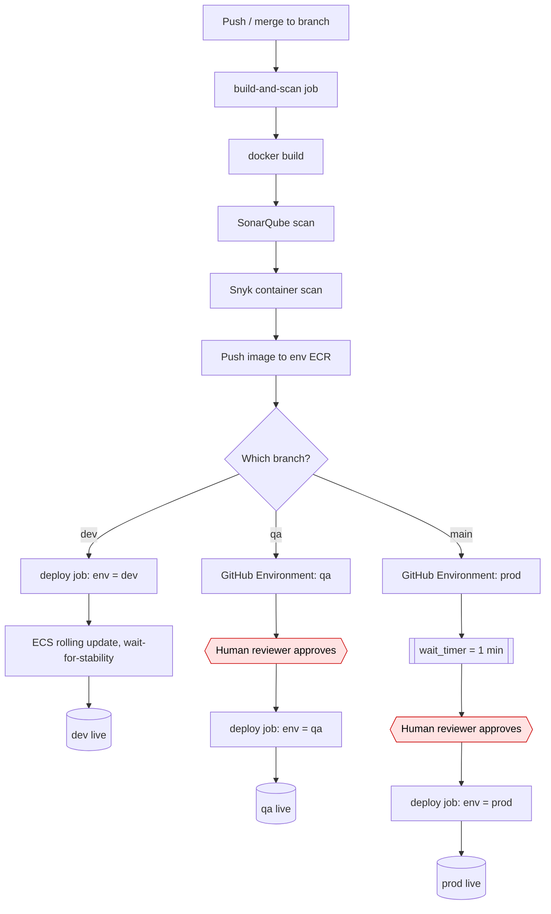
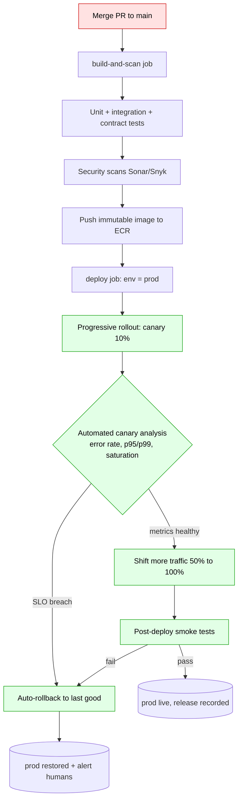

# Continuous delivery vs continuous deployment

This document explains the difference between continuous delivery and continuous
deployment, shows how the **cicd-ecs-security-E2E** repo behaves today (gated
delivery), and describes what it would look, feel, and run like as full
continuous deployment with no human gate to production, plus how to get there
safely.

> The current lab is **continuous delivery**: a push auto-deploys `dev`, while
> `qa` and `prod` require a human approval (GitHub Environment reviewers) and
> `prod` also waits on a timer. Full **continuous deployment** removes the human
> gate to production and replaces it with automated safety nets.

---

## 1. CI vs CD vs CD: definitions

Three terms get abbreviated to "CI/CD" but mean different things.

| Term | One-line distinction | Where the work stops |
| --- | --- | --- |
| **Continuous Integration (CI)** | Every commit is built and tested automatically against the mainline. | A green build and a tested artifact. Nothing ships. |
| **Continuous Delivery (CD)** | Every green build is automatically prepared and deployable, but a human decides when production happens. | An artifact that is one button-click away from production. |
| **Continuous Deployment (CD)** | Every green build that passes automated checks goes to production automatically, with no human in the loop. | Production, automatically. |

The crisp version:

- **Integration** answers "does it build and pass tests?"
- **Delivery** answers "is it ready to release on demand?" (human pulls the trigger)
- **Deployment** answers "is it released automatically?" (machine pulls the trigger)

### What changes operationally between delivery and deployment

The headline difference is the **removal of the manual approval step** to
production: in delivery a human pulls the trigger, in deployment the pipeline
does. The pipeline mechanics (testing, packaging, promotion) are largely the
same, but deployment is not just "delivery minus the button": it is only safe if
the automated safety nets (strong tests, smoke checks, progressive rollout,
auto-rollback) are actually in place to do the job the human used to do. That one
change has large operational consequences:

| Aspect | Continuous delivery (today) | Continuous deployment |
| --- | --- | --- |
| Production trigger | Human clicks "Approve" in the GitHub Environment | Automated, on merge to `main` |
| Gatekeeper | Reviewer judgment + wait timer | Automated tests, smoke checks, canary analysis |
| Confidence source | "A person looked at it" | "The pipeline proved it" |
| Failure handling | Human notices, human reverts | Automated rollback on SLO breach |
| Required test maturity | Helpful | Mandatory |
| Mean time from merge to prod | Minutes to days (waits on a person) | Minutes |

---

## 2. This repo's flow vs continuous deployment

### Current state: gated continuous delivery

This is what the seeded `.github/workflows/ci-cd.yml` and the Terraform-managed
GitHub Environments do today. A push to `dev` deploys with no gate. A push to
`qa` or `main` (prod) pauses for a human reviewer, and `prod` additionally waits
on a `wait_timer` of 1 minute.



Humans in the loop: **qa approval** and **prod approval** (the red nodes). The
`prod` path also has a wait timer before the human is even asked.

### Target state: continuous deployment

Here the merge to `main` is the last human action. Tests, smoke checks, a canary
with automated metric analysis, and auto-rollback replace the approver.



Humans in the loop: **only the PR review/merge** (the single red node). From
merge onward the pipeline decides, verifies, and self-heals (the green nodes).

---

## 3. What it feels like day to day under continuous deployment

| Dimension | What you experience |
| --- | --- |
| **Merge frequency** | Many small merges per day. The act of merging *is* the act of releasing. |
| **Lead time** | Minutes from merge to production, consistently, instead of waiting for an approver's calendar. |
| **Batch size** | Tiny. One change at a time, so when something breaks the blast radius and the bisect surface are both small. |
| **Cognitive load per deploy** | Low. No "deploy day" ceremony, no big-bang release, no manual checklist. |
| **On-call posture** | You trust the pipeline to catch and revert; you investigate alerts, you do not babysit deploys. |

### Cultural and quality prerequisites

Continuous deployment is a capability you earn, not a switch you flip. You need:

- **A strong, fast, trustworthy automated test suite.** If tests are flaky or
  thin, you are auto-shipping bugs. The suite must be the gate.
- **Trunk-based development.** Short-lived branches, merge to `main` often.
  Long-lived branches and continuous deployment are incompatible.
- **Feature flags.** Decouple *deploy* (code is in prod, dark) from *release*
  (feature is turned on). Lets you ship continuously and release on your terms.
- **Observability.** Metrics, logs, traces, and SLOs that a machine can read to
  decide "is this deploy healthy?"
- **Fast, automated rollback.** The undo button must be reliable and quick,
  because it is now pulled by a robot, not a person.

### Risks if you turn it on without those

- **Auto-shipping defects:** weak tests mean every regression reaches users.
- **Undetected degradation:** no SLOs/observability means nothing notices a slow
  leak until customers do.
- **No undo:** without automated rollback, an incident lasts as long as a human
  takes to wake up and intervene, which is worse than the gate you removed.
- **Coupled deploy and release:** without flags, a half-finished feature that
  merges is live immediately.
- **Big batches sneaking in:** without trunk-based discipline, you periodically
  auto-deploy a huge risky changeset.

---

## 4. The safety nets that REPLACE the human gate

A human approver is a slow, low-bandwidth, inconsistent test. Continuous
deployment swaps that one judgment call for several automated, repeatable checks.

| Human gate provided | Automated replacement |
| --- | --- |
| "Did someone look at it?" | Comprehensive automated tests (unit, integration, contract, e2e) run on every merge. |
| "Does it start and serve traffic?" | **Smoke tests** hit critical endpoints immediately after deploy. |
| "Is it safe for everyone?" | **Progressive delivery**: expose a small slice first, widen only if healthy. |
| "Is it actually healthy in prod?" | **Automated rollback on SLO breach**: watch error rate / latency / saturation and revert automatically. |
| "Is the feature ready for users?" | **Feature flags** decouple deploy from release, so unfinished code ships dark. |

The mental model: the human gate was a single binary checkpoint; the automated
nets are a *defense in depth* pipeline where each layer catches a different
class of failure.

---

## 5. Progressive delivery patterns

Progressive delivery is the family of techniques that limit how many users see a
new version at once, so a bad release hurts few people and can be reversed fast.

> Kubernetes context: in the enterprise pattern these strategies do not run from
> CI with `kubectl`. The desired state lives in a config repo and Argo CD
> reconciles it (GitOps), while **Argo Rollouts** or **Flagger** drive the
> canary/blue-green traffic shifting and the automated metric analysis. See
> [Deploy to EKS (GitOps with Argo CD)](02-deploy-to-eks.md), section 8, for the
> `Rollout` and `AnalysisTemplate` that implement this.

### Blue-green

Run two identical environments: **blue** (current) and **green** (new). Deploy
to green, verify it, then flip 100% of traffic at once. Roll back by flipping
back to blue.

- **When/why:** You want instant cutover and instant rollback, and you can
  afford to run two full stacks briefly.
- **ECS/ALB:** **AWS CodeDeploy blue/green for ECS** creates a replacement task
  set and shifts the ALB target group from blue to green. Rollback re-points the
  listener.
- **k8s:** Two Deployments/Services; switch the Service selector or Ingress, or
  use **Argo Rollouts** blue-green strategy with a preview service.

### Canary (with metric analysis)

Send a small percentage of traffic (for example 10%) to the new version, watch
the metrics, and increase only if healthy. Abort and roll back on a breach.

- **When/why:** You want production traffic to validate the change before full
  exposure, and you have good metrics to judge it automatically.
- **ECS/ALB:** CodeDeploy `Canary10Percent5Minutes` / `Linear10PercentEvery1Minute`
  traffic-shifting, weighted ALB target groups, with CloudWatch alarms as the
  rollback trigger.
- **k8s:** **Argo Rollouts** or **Flagger** drive weighted traffic via a service
  mesh / ingress and run **automated canary analysis** against Prometheus
  (or CloudWatch/Datadog) queries.

### Rolling

Replace instances/tasks a few at a time until the whole fleet runs the new
version. No second environment.

- **When/why:** Default, cheapest, good enough when changes are low-risk and
  backward compatible. This is what the lab does today.
- **ECS/ALB:** Native ECS rolling update via deployment min/max healthy percent
  (`wait-for-service-stability: true` in the seeded workflow).
- **k8s:** Native Deployment `RollingUpdate` with `maxSurge` / `maxUnavailable`.

### Shadow / dark launch

Send a **copy** of real production traffic to the new version without returning
its responses to users. Compare behavior and performance silently.

- **When/why:** High-risk changes (a rewritten service, a new model) where you
  want real load with zero user impact before any cutover.
- **ECS/ALB:** Mirror traffic with a service mesh (App Mesh) or a proxy; the
  shadow target set serves no user-facing responses.
- **k8s:** Istio/Envoy traffic mirroring to a shadow Deployment.

### Ring-based

Roll out in expanding **rings** of users: internal staff, then beta/early
adopters, then everyone. A staged generalization of canary across audiences.

- **When/why:** Large user bases where you want progressive blast-radius control
  by *who*, not just by *traffic percentage*.
- **ECS/ALB + flags:** Best expressed with **feature flags** targeting user
  cohorts on top of any deploy strategy.
- **k8s:** Multiple environments/namespaces or flag-based cohort targeting.

### Feature-flag tools (decouple deploy from release)

Across all patterns, **feature flags** let code be deployed (dark) and released
(turned on) independently. Tools: **LaunchDarkly**, **Unleash**, and the vendor-neutral
**OpenFeature** standard (which gives you a common SDK/API across providers).

### Strategy comparison

| Strategy | Downtime | Rollback speed | Cost | Complexity |
| --- | --- | --- | --- | --- |
| Rolling | None (if backward compatible) | Slow (roll forward/back instance by instance) | Low | Low |
| Blue-green | None | Instant (flip back) | High (2x stacks briefly) | Medium |
| Canary | None | Fast (stop shift, revert) | Medium | Medium-High (needs metric analysis) |
| Shadow/dark | None (no user impact) | N/A (no user traffic to revert) | High (extra capacity) | High |
| Ring-based | None | Fast (disable for ring) | Medium | Medium-High (cohort targeting) |

---

## 6. Metrics and verification that gate an automated promotion

When a human is removed, **metrics become the approver**. A promotion proceeds
only if the new version's signals stay within thresholds.

### Signals to gate on

| Signal | Example threshold | Why it gates |
| --- | --- | --- |
| **Error rate** | HTTP 5xx < 0.5% over the bake window | Direct correctness/availability signal. |
| **Latency p95/p99** | p95 < 300 ms, p99 < 800 ms, no regression vs baseline | Tail latency catches slow paths a mean would hide. |
| **Saturation** | CPU/memory/connection pool below limits | Detects a version that "works" but will tip over under load. |
| **Business KPIs** | Checkout conversion, signups, add-to-cart not dropping | Catches changes that are technically healthy but hurt the product. |

### Automated canary analysis and bake time

- **Automated canary analysis (ACA):** the rollout tool (Flagger, Argo Rollouts,
  or CodeDeploy + CloudWatch alarms) compares the canary's metrics against the
  baseline/stable version and computes pass/fail per step.
- **Bake time:** a deliberate soak period at each traffic step (for example, hold
  at 10% for 5 minutes) so slow-burning issues (memory leaks, queue backlogs)
  surface before you widen exposure.

### Tie to DORA metrics

The four DORA metrics measure software delivery performance. Continuous
deployment with strong safety nets is what moves them into the top ("elite") tier.
The exact band cutoffs shift slightly with each annual DORA report, so treat the
column below as the elite-tier direction, not fixed contractual numbers.

| DORA metric | What it measures | Elite tier (direction) |
| --- | --- | --- |
| **Deployment frequency** | How often you ship to prod | On-demand (multiple deploys per day) |
| **Lead time for changes** | Commit to running in prod | Less than one day (hours, not weeks) |
| **Change failure rate** | % of deploys causing a degradation needing remediation | Roughly 5% (low single digits) |
| **Failed deployment recovery time** | How fast you recover from a failed change | Less than one hour (auto-rollback makes this minutes) |

Note: recent DORA reports renamed the fourth metric from "mean time to restore
(MTTR)" to **failed deployment recovery time**, scoping it to recovery from a bad
deploy specifically. The throughput metrics (frequency, lead time) and the
stability metrics (change failure rate, recovery time) pull against each other;
pushing deploy frequency up while keeping failure rate and recovery time low is
exactly what canaries, smoke tests, and auto-rollback exist to do.

---

## 7. Converting THIS repo from delivery to deployment

The repo wires GitHub Environments from the `environments` variable in
`variables.tf`, materialized in `terraform.auto.tfvars` and applied in
`github.tf` (`github_repository_environment.this`). The approval gate lives in
the per-environment `required_reviewers` list; `prevent_self_review` and
`wait_timer` are the other relevant knobs.

### Step 1: Remove the production human gate

Today `prod` has a reviewer and a wait timer:

```hcl
# terraform.auto.tfvars (current, gated delivery)
prod = {
  branch             = "main"
  subdomain          = "prod"
  required_reviewers = ["kserge2001"]   # <-- the human gate
  protect_branch     = true
  wait_timer         = 1                # <-- forced pause
}
```

To make `prod` deploy automatically, set the reviewer list to empty:

```hcl
# terraform.auto.tfvars (continuous deployment)
prod = {
  branch             = "main"
  subdomain          = "prod"
  required_reviewers = []   # no human approval; pipeline is the gate
  protect_branch     = true # keep branch protection ON
  wait_timer         = 0    # remove the pause, OR keep a short bake window
}
```

This is safe to express in Terraform because `github.tf` already guards both the
reviewers block and self-review on a non-empty list:

```hcl
# github.tf (already in the repo)
prevent_self_review = var.prevent_self_review && length(each.value.required_reviewers) > 0

dynamic "reviewers" {
  for_each = length(each.value.required_reviewers) > 0 ? [1] : []
  ...
}
```

With `required_reviewers = []`, no `reviewers` block is created and
`prevent_self_review` evaluates to `false` for that environment, so the
environment imposes **no approval gate**. A `git push` / merge to `main` flows
straight through the `deploy` job. (`prevent_self_review` only matters while a
reviewer list exists; once it is empty there is nothing to self-review.)

### Step 2: Keep a bake window or replace it with a canary

You have two reasonable options:

- **Cheap:** keep a small `wait_timer` (for example 2-5 minutes) as a crude bake
  window. It is not real verification, but it gives alarms a moment to fire.
- **Real:** set `wait_timer = 0` and replace it with an actual canary. On ECS,
  switch the deploy step from the native rolling update to **AWS CodeDeploy
  blue/green** with a canary traffic-shift config and CloudWatch alarm rollback.

### Step 3: Add post-deploy smoke tests and auto-rollback

Extend the `deploy` job so a failed smoke test reverts the service. Two correctness
points the naive version gets wrong:

1. Capture the currently-running task definition **before** you deploy. After the
   deploy step runs, the new (failing) revision is the PRIMARY/ACTIVE one, so
   querying for the "active" task definition after the fact gives you the bad
   revision, not the good one you want to restore.
2. There is no `APP_DOMAIN` GitHub variable in this repo. The host is the
   per-environment subdomain on the Terraform `domain` value (prod is
   `prod.<domain>`), so use a literal env var you set on the job, not an invented
   `vars.*`.

```yaml
# appended to the deploy job in .github/workflows/ci-cd.yml
# (place "Capture current task definition" BEFORE the "Deploy to Amazon ECS" step)
- name: Capture current task definition (for rollback)
  id: prev
  run: |
    arn=$(aws ecs describe-services \
      --cluster "${{ vars.ECS_CLUSTER }}" --services "${{ vars.ECS_SERVICE }}" \
      --query 'services[0].taskDefinition' --output text)
    echo "task_def=$arn" >> "$GITHUB_OUTPUT"

# ... existing "Deploy to Amazon ECS" step runs here ...

- name: Smoke test prod endpoint
  id: smoke
  env:
    # Set as a literal here; do NOT reference a non-existent vars.APP_DOMAIN.
    SMOKE_URL: https://prod.example.com/healthz   # replace with prod.<your-domain>/healthz
  run: |
    set -u
    for i in $(seq 1 10); do
      code=$(curl -s -o /dev/null -w '%{http_code}' "$SMOKE_URL" || true)
      [ "$code" = "200" ] && echo "healthy" && exit 0
      sleep 6
    done
    echo "smoke test failed (last code: ${code:-none})"; exit 1

- name: Roll back to previous task definition
  if: failure() && steps.smoke.outcome == 'failure'
  run: |
    aws ecs update-service \
      --cluster "${{ vars.ECS_CLUSTER }}" --service "${{ vars.ECS_SERVICE }}" \
      --task-definition "${{ steps.prev.outputs.task_def }}" --force-new-deployment
```

> Note: `wait-for-service-stability: true` is already set in the seeded deploy
> step, so a deployment that never stabilizes will already fail the job. The
> smoke test adds *behavioral* verification on top of *stability*, and the
> rollback step gives you the automated undo that the human used to provide. This
> task-definition swap is a real but crude rollback; the production-grade version
> is AWS CodeDeploy blue/green with a CloudWatch alarm rollback (Step 2), which
> reverts automatically without a custom shell step.

### If you run on Kubernetes instead of ECS

The same delivery-to-deployment switch looks different under GitOps (see
[02-deploy-to-eks.md](02-deploy-to-eks.md)). There is no GitHub Environment
reviewer and no `kubectl` step to remove. Instead:

- The promotion gate is a **Pull Request against the config repo**, enforced by
  branch protection plus `CODEOWNERS` on `overlays/prod/` (for example, the SRE
  team owns the prod overlay). Removing the human gate for prod means letting CI
  commit the image-tag bump straight to the config repo's `main` (as dev already
  does) instead of opening a PR, or letting Argo CD Image Updater write the tag.
- The Argo CD `Application` for prod must move from manual sync to
  `syncPolicy.automated` with `selfHeal` and `prune` (the dev pattern in
  02-deploy-to-eks.md section 6), so a merged change reconciles without a human
  clicking Sync.
- Safety is provided by an **Argo Rollouts** `Rollout` (canary or blue-green)
  with an `AnalysisTemplate` that auto-aborts and rolls back on an SLO breach,
  which replaces the human approver exactly as the canary does on ECS.

### Trade-offs and a prerequisite warning

- **You are trading human judgment for test coverage.** If the test suite is
  weak, you have made things worse, not better. **Branch protection plus a
  strong required status check must be solid first.** The repo already requires
  the `build-and-scan` status check and PR review on `main` via
  `github_branch_protection.main`; that is the foundation continuous deployment
  stands on. Do not remove the `prod` gate until that foundation is trustworthy.
- Keeping `protect_branch = true` and the required status check means a merge to
  `main` still cannot happen without green CI, even though the *deploy* is now
  unattended.
- In a solo lab (`required_pr_approvals = 0`, `prevent_self_review = false`)
  there is effectively no human in the loop already once you empty
  `required_reviewers`, so treat this as a demonstration, not a production
  pattern, unless the automated nets above are genuinely in place.

---

## 8. Readiness checklist: are you ready for continuous deployment?

Treat this as a gate. If you cannot honestly check most of these, stay on gated
delivery.

**Tests and CI**

- [ ] Fast, reliable automated test suite (unit + integration + contract) that
      you trust as the gate.
- [ ] Tests are required status checks on `main`; a red build cannot merge.
- [ ] Non-flaky pipeline (flaky tests destroy trust and get ignored).
- [ ] Security/quality scans run on every change (Sonar/Snyk already wired here).

**Delivery practices**

- [ ] Trunk-based development with short-lived branches.
- [ ] Small, frequent, backward-compatible changes (including DB migrations).
- [ ] Feature flags available to decouple deploy from release.

**Production safety**

- [ ] Progressive delivery configured (canary or blue-green), not just rolling:
      CodeDeploy blue/green on ECS, or Argo Rollouts / Flagger on Kubernetes.
- [ ] Post-deploy smoke tests on critical paths.
- [ ] Defined SLOs and alerts that a machine can evaluate.
- [ ] Automated rollback on SLO breach, tested and proven to work.

**Observability and operations**

- [ ] Metrics, logs, and traces in place (error rate, p95/p99, saturation).
- [ ] Dashboards and alerting tied to the rollout (automated canary analysis).
- [ ] On-call and incident response ready for unattended deploys.

**Organizational**

- [ ] Team agrees deploys are routine, not events.
- [ ] DORA metrics are tracked so you can see if removing the gate helped or hurt
      (watch change failure rate and MTTR closely after the switch).

If most boxes are checked, removing the `prod` reviewer is a safe, deliberate
step. If not, the human gate is doing real work: keep it.
