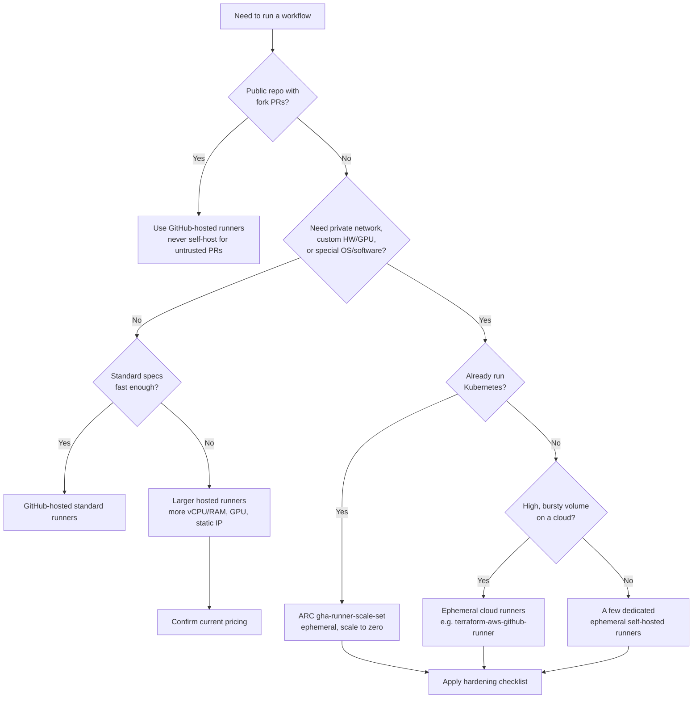

# GitHub Actions runners: hosted, self-hosted, and Kubernetes

This document explains GitHub Actions runners in depth and how to scale them. It is part of the **cicd-ecs-security-E2E** lab and reflects the current (2025-2026) GitHub Actions platform, including the `gha-runner-scale-set` model of Actions Runner Controller (ARC).

A **runner** is the machine (or container) that executes a job from your workflow. When a workflow is triggered, GitHub queues each job and waits for an available runner whose labels match the job's `runs-on`. The runner picks up the job, runs every step, streams logs back to GitHub, and reports the result.

There are three broad families:

1. **GitHub-hosted runners**: managed, ephemeral VMs that GitHub provisions for you.
2. **Self-hosted runners**: machines you own and register against a repo, org, or enterprise.
3. **Kubernetes runners**: self-hosted runners that live as pods in a cluster, autoscaled by ARC.

---

## Table of contents

- [1. GitHub-hosted runners](#1-github-hosted-runners)
- [2. Self-hosted runners](#2-self-hosted-runners)
- [3. Comparison table](#3-comparison-table)
- [4. Adding a self-hosted runner (step by step)](#4-adding-a-self-hosted-runner-step-by-step)
- [5. Kubernetes runners with Actions Runner Controller (ARC)](#5-kubernetes-runners-with-actions-runner-controller-arc)
- [6. Other scaling and auto-scaling options](#6-other-scaling-and-auto-scaling-options)
- [7. Security of self-hosted runners](#7-security-of-self-hosted-runners)
- [8. Choosing the right model](#8-choosing-the-right-model)
- [Appendix: quick reference](#appendix-quick-reference)

---

## 1. GitHub-hosted runners

GitHub-hosted runners are virtual machines that GitHub creates, runs, and destroys for each job. You do not provision, patch, or pay for idle capacity. You select one with a label like `runs-on: ubuntu-latest`, and GitHub does the rest.

### The clean ephemeral VM model

Every job gets a **fresh, single-use virtual machine**. The VM is created right before the job starts and is **permanently destroyed** when the job finishes. Key consequences:

- No state survives between jobs. Anything you need across jobs must go through artifacts, caches, or external storage.
- There is no cross-job contamination: secrets, files, and processes from one job cannot leak into the next.
- You always start from a known-good base image, so builds are reproducible.

This clean-room model is the single biggest security advantage of hosted runners, and it is exactly what you must recreate on self-hosted runners using the `--ephemeral` flag (see [section 4](#4-adding-a-self-hosted-runner-step-by-step)).

### Standard images and specs

GitHub maintains a set of standard images. The most common labels:

| Label | OS | Notes |
| --- | --- | --- |
| `ubuntu-latest` | Ubuntu (currently 24.04) | Default for most Linux jobs. `ubuntu-24.04`, `ubuntu-22.04` pin a version. |
| `windows-latest` | Windows Server (currently 2022) | `windows-2025`, `windows-2022` pin a version. |
| `macos-latest` | macOS (currently 14, Apple silicon) | `macos-15`, `macos-14`, `macos-13` pin a version. Intel images are being retired. |

> The OS that `*-latest` points to changes over time as GitHub rolls forward. Pin an explicit version (for example `ubuntu-24.04`) when you need stability across that transition.

Standard free-tier VM specs (subject to change by GitHub):

| Runner | vCPU | RAM | SSD (workspace) |
| --- | --- | --- | --- |
| Linux / Windows (standard) | 4 | 16 GB | 14 GB |
| macOS (standard) | 3-4 (Apple silicon) | 7-14 GB | 14 GB |

### Included tooling

Standard images ship pre-loaded so most builds run with zero setup. Typical contents:

- Language toolchains: Node.js, Python, Go, Java/JDKs, .NET, Ruby, PHP, Rust.
- Build tools: `make`, `cmake`, `gcc`/`clang`, MSBuild (Windows), Xcode (macOS).
- Cloud and container CLIs: `docker`, `docker buildx`, `kubectl`, `helm`, `aws`, `az`, `gcloud`, `terraform`.
- VCS and utilities: `git`, `gh` (GitHub CLI), `jq`, `curl`, `zip`.

The full inventory per image lives in the [`actions/runner-images`](https://github.com/actions/runner-images) repository. Use the version manager actions (for example `actions/setup-node`) to pin exact versions rather than relying on whatever the image ships.

### Per-minute billing

- **Public repositories**: GitHub-hosted runners are **free**, with generous concurrency limits.
- **Private repositories**: you get a monthly allowance of included minutes by plan, then pay per minute beyond it.
- **Billing is by the minute, rounded up**, and is **multiplied by an OS factor**:

| OS | Cost multiplier |
| --- | --- |
| Linux (standard) | 1x |
| Windows | 2x |
| macOS | 10x |

A 10-minute macOS job consumes roughly 100 billable minutes. Larger runners are billed at higher per-minute rates than standard runners. Always confirm current pricing in [GitHub's billing docs](https://docs.github.com/billing), because rates and multipliers change.

### Limitations

- **No persistent state**: nothing survives the VM. Use `actions/cache` and `actions/upload-artifact`.
- **Job time limit**: a single job can run for at most **6 hours**, and a workflow run for **35 days** (most of which is queue/wait time, not execution).
- **Network egress**: hosted runners have outbound internet access but live on shared, rotating IP ranges. You cannot reliably allowlist their IPs on a firewall, and they cannot reach private/internal networks. (Larger runners can add a static outbound IP, see below.)
- **Concurrency limits**: there is a cap on how many jobs you can run at once, varying by plan.
- **No custom hardware**: no GPUs on standard runners, fixed CPU/RAM.

### Larger runners

For heavier workloads, GitHub offers **larger runners** (a paid, configurable tier available on Team and Enterprise plans):

- More vCPU and RAM (for example 8, 16, 32, 64 vCPU configurations).
- **GPU-enabled** runners for ML/CUDA workloads.
- **Static outbound IP addresses**, so you can allowlist them on a firewall or private service.
- Larger disk, and the ability to define **custom runner groups** and labels.

You create them under organization or enterprise **Settings -> Actions -> Runners -> New runner -> New GitHub-hosted runner**, give them a name (which becomes the `runs-on` label), and target them like `runs-on: my-big-runner`.

**Pay for larger runners when**: builds are CPU/RAM bound and slow on standard specs, you need a GPU, you need a stable egress IP for firewall allowlisting, or faster wall-clock time is worth more than the higher per-minute rate. If you mainly need **private network access or custom software**, a self-hosted runner is usually the better tool.

---

## 2. Self-hosted runners

A self-hosted runner is a machine **you provide and manage** that connects to GitHub and runs your jobs. It can be a bare-metal box, a VM, a container, or a Kubernetes pod. The runner application makes an **outbound** long-poll connection to GitHub (no inbound ports to open), pulls assigned jobs, and runs them.

### When to use self-hosted runners

- **Custom hardware or GPU**: specialized CPUs, lots of RAM, GPUs, ARM boards, or specific accelerators.
- **Private network access**: jobs need to reach internal services (databases, artifact registries, internal APIs, a VPC) that hosted runners cannot see.
- **Specific OS or pre-installed software**: a particular Linux distro, kernel, licensed software, or a heavyweight toolchain you do not want to install on every run.
- **Cost at high volume**: at very high minute counts, running your own (especially spot/preemptible) capacity can be cheaper than per-minute billing, particularly for Windows/macOS factors.
- **Larger / persistent caches**: big dependency caches or Docker layer caches that are expensive to rebuild each run benefit from local disk (use with care, see security).

### Trade-offs and responsibilities

When you self-host, **you** own everything the hosted platform used to handle:

- **Patching and OS hardening**: kernel, packages, the runner agent, and the container runtime.
- **Security isolation**: preventing one job from poisoning the host or the next job.
- **Availability and scaling**: capacity planning, autoscaling, and dealing with stuck or crashed runners.
- **Monitoring and logging**: you must observe health, disk, and security events yourself.
- **Secret hygiene**: a long-lived runner can accumulate state and leaked credentials between jobs unless it is ephemeral.

The golden rule that flows from these responsibilities: **prefer ephemeral, single-use runners**, and **never expose self-hosted runners to untrusted code** (see [section 7](#7-security-of-self-hosted-runners)).

---

## 3. Comparison table

| Dimension | GitHub-hosted (standard) | Larger hosted | Self-hosted |
| --- | --- | --- | --- |
| **Cost model** | Free (public) / per-minute with OS multiplier (private) | Higher per-minute rate; configurable specs | You pay infra + ops time; can be cheaper at high volume |
| **Maintenance** | Zero (GitHub manages) | Zero (GitHub manages) | You patch, harden, scale, monitor |
| **Security isolation** | Strong: fresh single-use VM per job | Strong: fresh single-use VM per job | Only as strong as you make it; use `--ephemeral` |
| **Scalability** | Auto, up to plan concurrency limits | Auto, up to configured limits | You build it (ARC, cloud autoscaler, or fixed pool) |
| **Network access** | Public internet only, rotating IPs | Public internet, optional **static IP** | Full access to your private network/VPC |
| **Persistence** | None | None | Possible (risky); ephemeral recommended |
| **Custom hardware/GPU** | No (standard) | GPU available | Anything you provision |
| **Public-repo fork PRs** | Safe | Safe | **Unsafe by default; do not use** |
| **Setup effort** | None | Minimal (UI) | Moderate to high |

---

## 4. Adding a self-hosted runner (step by step)

Self-hosted runners can be registered at three levels. Choose the narrowest scope that meets your need:

| Level | Settings location | Use when |
| --- | --- | --- |
| **Repository** | `Repo -> Settings -> Actions -> Runners` | A single project owns the runner |
| **Organization** | `Org -> Settings -> Actions -> Runners` | Multiple repos share runners (use runner groups) |
| **Enterprise** | `Enterprise -> Policies -> Actions -> Runners` | Fleet-wide, central management |

### Step 1: Create the runner in Settings

1. Go to the appropriate **Settings -> Actions -> Runners** page.
2. Click **New runner -> New self-hosted runner**.
3. Select the runner OS and architecture (for example Linux x64).
4. GitHub shows a set of commands containing a **registration token** (short-lived). Copy them.

### Step 2: Download and configure (`config.sh`) on Linux

On the host that will run jobs:

```bash
# Create a dedicated, non-root user and working dir
sudo useradd -m -s /bin/bash gh-runner
sudo -iu gh-runner

mkdir actions-runner && cd actions-runner

# Download the runner package (use the version GitHub shows you)
curl -o actions-runner-linux-x64.tar.gz -L \
  https://github.com/actions/runner/releases/download/vX.Y.Z/actions-runner-linux-x64-X.Y.Z.tar.gz

tar xzf actions-runner-linux-x64.tar.gz

# Configure against your repo/org with the token from the UI
./config.sh \
  --url https://github.com/<OWNER>/<REPO> \
  --token <REGISTRATION_TOKEN> \
  --name "$(hostname)-runner" \
  --labels self-hosted,linux,x64,gpu \
  --work _work
```

`config.sh` registers the runner and writes a `.runner` config plus a short-lived credential it uses to authenticate.

### Step 3: Run it

Interactively (good for testing):

```bash
./run.sh
```

As a managed service (recommended for long-lived runners):

```bash
# Installs and starts a systemd service running as the gh-runner user
sudo ./svc.sh install gh-runner
sudo ./svc.sh start
sudo ./svc.sh status
```

### Step 4: Target the runner with `runs-on` and labels

Every self-hosted runner automatically gets the `self-hosted` label, plus any `--labels` you set. Target by combining labels (all must match):

```yaml
jobs:
  build:
    # Requires a runner that has ALL of these labels
    runs-on: [self-hosted, linux, gpu]
    steps:
      - uses: actions/checkout@v4
      - run: nvidia-smi
```

For larger fleets, organize runners into **runner groups** and restrict which repositories/workflows may use each group (org/enterprise Settings -> Actions -> Runner groups). This is a core access-control mechanism (see [section 7](#7-security-of-self-hosted-runners)).

### Step 5: Ephemeral runners (`--ephemeral`) and why they matter

By default a runner is **persistent**: it runs job after job, and any leftover files, environment changes, cached credentials, or malicious modifications from one job persist into the next. That is a security and reproducibility hazard.

An **ephemeral runner** runs **exactly one job, then unregisters and exits**. Pair this with automation (or ARC) that starts a fresh runner for the next job. This recreates the hosted clean-room model.

```bash
./config.sh \
  --url https://github.com/<OWNER>/<REPO> \
  --token <REGISTRATION_TOKEN> \
  --name "ephemeral-$(uuidgen)" \
  --labels self-hosted,linux,ephemeral \
  --ephemeral

# Run once; the process exits after a single job
./run.sh
```

Why ephemeral matters:

- **Fresh environment per job**: no leftover files, processes, or tools.
- **Prevents state and secret bleed**: secrets injected for one job cannot be read by the next.
- **Limits attacker persistence**: code that compromises a runner is wiped when the runner is destroyed.

For real fleets, do not script this by hand. Use **ARC** (section 5) or a **cloud autoscaler** (section 6), both of which manage ephemeral runners for you.

### Step 6: Remove a runner

Cleanly deregister so GitHub does not keep waiting on a dead runner:

```bash
# Stop and remove the service if installed
sudo ./svc.sh stop
sudo ./svc.sh uninstall

# Deregister from GitHub (needs a fresh removal token from the UI/API)
./config.sh remove --token <REMOVAL_TOKEN>
```

You can also force-remove an offline runner from the **Settings -> Actions -> Runners** page or via the REST API. Ephemeral runners deregister themselves automatically after their single job.

---

## 5. Kubernetes runners with Actions Runner Controller (ARC)

**Actions Runner Controller (ARC)** is the official, GitHub-supported way to run self-hosted runners on Kubernetes. The current, supported architecture is the **`gha-runner-scale-set`** model (the older `RunnerDeployment`/`HorizontalRunnerAutoscaler` CRDs are the legacy "community" mode; new deployments should use the scale-set charts).

### What ARC is and how it works

ARC is a Kubernetes operator (a controller plus Helm charts) that:

- Watches GitHub for **queued jobs** that target a given scale set.
- Creates a fresh **ephemeral runner pod** for each job (one job per pod).
- Tears the pod down when the job completes.
- **Scales to zero** when there is no work, and scales up on demand, so you pay only for pods that are actually running jobs.

There are two charts:

1. **`gha-runner-scale-set-controller`**: the controller/operator. Install once per cluster.
2. **`gha-runner-scale-set`**: a runner scale set. Install one per logical pool of runners (each gets a name you reference in `runs-on`).

### Install via Helm

```bash
# 1. Install the controller (once per cluster)
helm install arc \
  --namespace arc-systems --create-namespace \
  oci://ghcr.io/actions/actions-runner-controller-charts/gha-runner-scale-set-controller

# 2. Install a runner scale set (the install name becomes the runs-on label)
helm install my-runner-set \
  --namespace arc-runners --create-namespace \
  -f values.yaml \
  oci://ghcr.io/actions/actions-runner-controller-charts/gha-runner-scale-set
```

### Authentication: GitHub App vs PAT

ARC must authenticate to GitHub to register runners and read the job queue. Two options:

| Method | Pros | Cons | Recommendation |
| --- | --- | --- | --- |
| **GitHub App** | Fine-grained, scoped, higher rate limits, rotatable, not tied to a person | Slightly more setup (App ID, install ID, private key) | **Preferred**, especially for org/enterprise |
| **PAT (personal access token)** | Quick to set up | Tied to a user, broad scope, easy to over-grant, expires/needs rotation | Fine for a quick lab, avoid in production |

Store credentials in a Kubernetes secret. Example for a GitHub App:

```bash
kubectl create secret generic arc-github-app \
  --namespace arc-runners \
  --from-literal=github_app_id=<APP_ID> \
  --from-literal=github_app_installation_id=<INSTALL_ID> \
  --from-file=github_app_private_key=./private-key.pem
```

PAT alternative (placeholder, do not commit real tokens):

```bash
kubectl create secret generic arc-pat \
  --namespace arc-runners \
  --from-literal=github_token=<YOUR_PAT_PLACEHOLDER>
```

### Sample `values.yaml`

```yaml
# values.yaml for a gha-runner-scale-set install
githubConfigUrl: "https://github.com/<OWNER>/<REPO>"   # or org/enterprise URL

# Reference the pre-created secret (GitHub App shown here)
githubConfigSecret: arc-github-app

# Autoscaling bounds: 0 means scale fully to zero when idle
minRunners: 0
maxRunners: 20

# Optional: restrict to a runner group (org/enterprise scoped)
runnerGroup: "k8s-prod"

# Runner pod template
template:
  spec:
    containers:
      - name: runner
        image: ghcr.io/actions/actions-runner:latest
        command: ["/home/runner/run.sh"]
```

Runners created by this scale set are **always ephemeral** (one job per pod), so the clean-room model is built in.

### Target the scale set with `runs-on`

The Helm **install name** of the scale set is the label you target:

```yaml
jobs:
  build:
    runs-on: my-runner-set   # matches the helm install name
    steps:
      - uses: actions/checkout@v4
      - run: echo "Running in an ephemeral ARC pod"
```

### Building images inside the cluster: container vs dind vs kubernetes mode

Building container images inside a runner pod is the classic pain point, because the pod itself is a container. Options:

| Mode | How it works | Trade-offs |
| --- | --- | --- |
| **Default (no Docker)** | Plain runner pod, no Docker daemon | Cannot build images; fine for test/lint/non-Docker jobs |
| **dind (Docker-in-Docker)** | A `dind` sidecar runs a Docker daemon in the pod | Familiar `docker build`, but usually needs a **privileged** container (security risk) |
| **kubernetes mode** | ARC schedules each job step as its own pod via a hook | No privileged Docker daemon; needs a configured PVC and hook extension; steps run as pods |

For **rootless, daemonless image builds** (the recommended path on Kubernetes), use a purpose-built builder instead of a privileged Docker daemon:

- **BuildKit** (`buildkitd` / `buildctl`, or `docker buildx` against a BuildKit pod): can run rootless.
- **Kaniko**: builds from a Dockerfile inside a container with no daemon and no privileged mode.
- **buildah**: daemonless OCI image builds, supports rootless.

Example Kaniko step (no privileged daemon required):

```yaml
- name: Build and push with Kaniko
  run: |
    /kaniko/executor \
      --context "${{ github.workspace }}" \
      --dockerfile Dockerfile \
      --destination "<REGISTRY>/<IMAGE>:${{ github.sha }}"
```

Prefer rootless BuildKit/Kaniko/buildah over privileged dind whenever you can; privileged containers weaken the isolation that ephemeral pods give you.

---

## 6. Other scaling and auto-scaling options

ARC is ideal if you already run Kubernetes. If you do not, there are other ways to get **ephemeral, autoscaling** self-hosted capacity.

### Ephemeral cloud runners (AWS pattern)

The well-known **[`philips-labs/terraform-aws-github-runner`](https://github.com/philips-labs/terraform-aws-github-runner)** module is a widely used, open-source pattern for ephemeral runners on AWS:

- A **GitHub App webhook** notifies AWS when a job is queued.
- **Lambda** functions scale runners up and down in response to the webhook.
- Runners launch as **EC2 instances** (often **spot** for cost), register as **ephemeral**, run one job, then terminate.
- Supports Linux/Windows, ARM/x64, and warm pools to reduce cold-start latency.

This gives you hosted-like elasticity with full control over instance types, VPC placement, and IAM. Similar patterns exist for other clouds (for example scale sets on Azure, MIGs on GCP). The common theme: **event-driven, ephemeral, scale-to-zero**.

### Third-party managed runner services

A category of vendors offers **managed, drop-in runners** that you target via a custom `runs-on` label, marketing faster machines and/or lower cost than standard GitHub-hosted minutes. They handle provisioning and scaling for you, similar to larger hosted runners but from a third party.

Treat this category with appropriate caution: you are giving an external provider access to your CI (and potentially your code and secrets). Evaluate their isolation model, data handling, compliance posture, and whether they support ephemeral runners before adopting one. This document does not endorse a specific vendor.

---

## 7. Security of self-hosted runners

Self-hosted runners are the most common foot-gun in GitHub Actions security. The runner executes arbitrary workflow code on **your** infrastructure, with access to whatever that host can reach.

### The cardinal rule: never expose self-hosted runners to untrusted code

> **Do not use self-hosted runners on a public repository where fork pull requests can trigger workflows.**

On a public repo, anyone can open a PR from a fork. If that PR's workflow runs on your self-hosted runner, the PR author's code runs on your machine, inside your network, possibly with cached credentials. This is remote code execution by design. Mitigations:

- Use **GitHub-hosted runners** (fresh, isolated VMs) for anything triggered by untrusted PRs.
- If you must self-host, require approval: use the `pull_request_target` carefully, environment **required reviewers**, or the org setting **"Require approval for all outside collaborators / first-time contributors."**
- Keep self-hosted runners for **private repos** and trusted, internal workflows.

### Always prefer ephemeral

Use `--ephemeral` (or ARC, which is ephemeral by default). A persistent runner lets an attacker leave behind backdoors, harvest the next job's secrets, or poison caches. Ephemeral runners are wiped after every single job.

### Hardening checklist

- [ ] **Ephemeral runners only** (`--ephemeral` or ARC). One job per runner, then destroy.
- [ ] **Never on public repos with fork PRs.** Use hosted runners for untrusted code.
- [ ] **Network isolation.** Put runners in a dedicated subnet/namespace with **egress filtering**; only allow the destinations jobs actually need. Block access to cloud metadata endpoints (for example `169.254.169.254`) unless explicitly required.
- [ ] **Least-privilege cloud roles.** Scope the runner's IAM role/service account to the minimum; prefer short-lived **OIDC** federation over long-lived static cloud keys.
- [ ] **Runner groups.** Restrict which repositories and workflows may use each runner group (org/enterprise level). Do not let every repo target your sensitive runners.
- [ ] **Run as a non-root, unprivileged user.** Avoid privileged containers; if you build images, prefer rootless BuildKit/Kaniko/buildah over privileged dind.
- [ ] **Harden the host.** Minimal base OS, automatic security patching, no unnecessary services, disk encryption, host firewall.
- [ ] **Protect secrets.** Do not store long-lived secrets on the runner; inject per-job via OIDC or short-lived tokens; never echo secrets to logs.
- [ ] **Pin and review actions.** Pin third-party actions to a full commit SHA, not a mutable tag; review what they do.
- [ ] **Limit who can change workflows.** Use branch protection and CODEOWNERS on `.github/workflows`.
- [ ] **Monitor and log.** Ship runner and host logs to a central system; alert on anomalous network egress, new processes, and runner registration changes.
- [ ] **Set timeouts.** Use `timeout-minutes` to bound runaway jobs.

---

## 8. Choosing the right model

A short decision guide. Start with the safest, lowest-ops option and only move toward self-hosting when a concrete requirement forces it.



Rules of thumb by team profile:

| Profile | Recommended model |
| --- | --- |
| Small team, public OSS repo | GitHub-hosted (free, safe) |
| Small/medium private team, normal builds | GitHub-hosted standard |
| Builds CPU/RAM/GPU bound, no private-net need | Larger hosted runners |
| Need internal network / custom OS, runs Kubernetes | ARC scale sets (ephemeral) |
| Need internal network, no Kubernetes, bursty | Ephemeral cloud runners (AWS pattern) |
| Enterprise fleet, many repos, strict isolation | ARC or cloud autoscaler + runner groups + OIDC |

Whatever you choose, if it is self-hosted: **ephemeral, isolated, least-privilege, monitored.**

---

## Appendix: quick reference

Common commands:

```bash
# Register a self-hosted runner (ephemeral, recommended)
./config.sh --url https://github.com/<OWNER>/<REPO> \
  --token <REGISTRATION_TOKEN> --labels self-hosted,linux,ephemeral --ephemeral

# Run once
./run.sh

# Install and run as a service (persistent runners only)
sudo ./svc.sh install <USER> && sudo ./svc.sh start

# Remove / deregister
./config.sh remove --token <REMOVAL_TOKEN>

# ARC: install controller, then a scale set
helm install arc -n arc-systems --create-namespace \
  oci://ghcr.io/actions/actions-runner-controller-charts/gha-runner-scale-set-controller
helm install my-runner-set -n arc-runners --create-namespace -f values.yaml \
  oci://ghcr.io/actions/actions-runner-controller-charts/gha-runner-scale-set
```

Useful references:

- `actions/runner-images`: contents of GitHub-hosted images.
- `actions/actions-runner-controller`: ARC source and docs.
- `philips-labs/terraform-aws-github-runner`: ephemeral AWS runners.
- GitHub Docs: "Hosting your own runners", "Using larger runners", "Billing for GitHub Actions".

> Specs, pricing, default image versions, and concurrency limits change over time. Verify the current numbers in the official GitHub documentation before relying on them.
