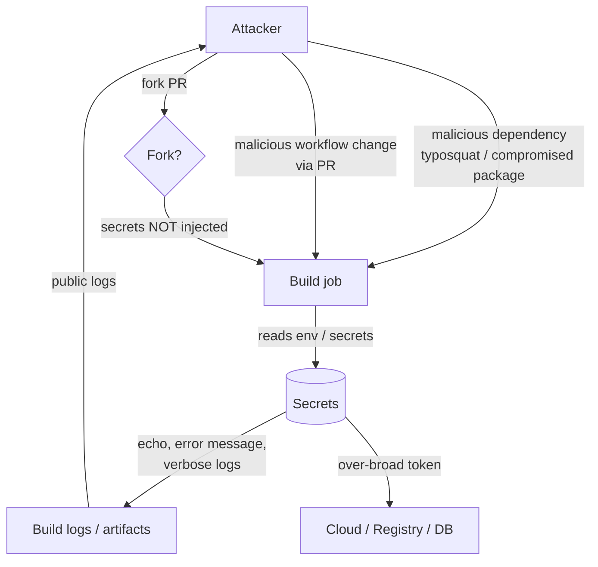
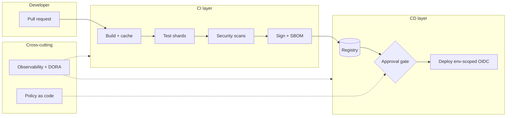

# Securing the pipeline: secrets, and CI/CD architecture concerns

This document covers two related concerns for any serious CI/CD platform:

- **Part A:** how sensitive data (secrets) flows through the pipeline, the threat model, and how to manage it well.
- **Part B:** the architectural qualities (security, scalability, reliability, maintainability, observability, cost, governance) that separate a hobby pipeline from a well-architected delivery platform.

Examples are grounded in this repo (`cicd-ecs-security-E2E`), a Terraform-provisioned CI/CD + DevSecOps lab that already uses GitHub Actions OIDC (no long-lived AWS keys), per-environment OIDC deploy roles, GitHub repo/environment variables and secrets, and environment-scoped secrets that resolve only after approval. See [`github.tf`](../github.tf) and [`iam.tf`](../iam.tf) for the real implementation.

---

## Part A: Sensitive data and secrets in the pipeline

### A.1 Types of sensitive data and the threat model

A CI/CD pipeline is one of the most attractive targets in an organization: it holds credentials to almost everything and runs arbitrary code on every commit.

#### Types of sensitive data

| Category | Examples | Typical blast radius if leaked |
|---|---|---|
| Cloud credentials | AWS access keys, IAM role trust, GCP service-account JSON, Azure SP secret | Full account takeover, data exfiltration, crypto mining |
| Registry credentials | Docker Hub / ECR / GHCR push tokens | Supply-chain poisoning of published images |
| Signing keys | cosign private key, GPG keys, code-signing certs | Attacker can sign malicious artifacts as "trusted" |
| Database passwords | Postgres/MySQL/Mongo creds, connection strings | Data breach, data destruction |
| API tokens | SonarQube, Snyk, Slack, PagerDuty, third-party SaaS | Lateral movement, spoofed alerts |
| TLS keys | Private keys for serving certs, mTLS client keys | Traffic interception, impersonation |
| PII in test data | Real customer data used as fixtures | Regulatory exposure (GDPR, HIPAA) |

#### The threat model

The pipeline runs code, so anyone who can influence what code runs can influence what the pipeline does with its secrets.



Primary attack paths:

- **Secret exfiltration via malicious dependency.** A compromised npm/pip/Go module runs in the build with access to whatever the job can read (env vars, mounted files, the `GITHUB_TOKEN`). It quietly POSTs them to an attacker endpoint.
- **Malicious workflow change.** A contributor (or compromised account) edits `.github/workflows/*` to print or forward secrets. Branch protection and required reviews on workflow files are the mitigation.
- **Log leakage.** Secrets accidentally `echo`ed, embedded in error output, or written to uploaded artifacts. Masking helps but is not a guarantee (see A.3).
- **Fork PRs.** A pull request from a fork should never receive your secrets, otherwise any stranger can open a PR that steals them. The `pull_request_target` trigger is the classic footgun here (see A.3).

---

### A.2 The hierarchy: from hardcoded (never) to dynamic secrets

There is a clear ladder of maturity. Climb as high as your platform allows.

| Tier | Approach | Lifetime | Blast radius | Verdict |
|---|---|---|---|---|
| 0 | Hardcoded in source / Dockerfile | Forever (until rotated) | Everyone with repo or image access | Never |
| 1 | CI secret store (GitHub Actions secrets) holding a long-lived credential | Until manually rotated | Anyone who can run a job | Last resort: only when the provider has no federation option |
| 2 | Short-lived OIDC / workload identity (keyless) | Minutes | A single job run | The baseline for any cloud or registry that supports it |
| 3 | External secrets manager + dynamic secrets | Seconds to minutes, generated on demand | One job, auto-revoked | Best |

#### Why OIDC keyless auth beats stored keys (and how this repo does it)

With stored cloud keys, you have a long-lived credential sitting in the CI secret store. If it leaks, it works until someone notices and rotates it.

With **OIDC**, GitHub Actions mints a short-lived signed JSON Web Token (JWT) describing the run (repo, branch, environment, actor). AWS STS verifies that token against a trusted identity provider and a role trust policy, then issues **temporary** credentials valid for the job only. Nothing long-lived is ever stored.

This repo implements exactly that. In [`iam.tf`](../iam.tf):

```hcl
# Trust the GitHub OIDC provider, but only for THIS repo and THIS env/branch.
condition {
  test     = "StringLike"
  variable = "token.actions.githubusercontent.com:sub"
  values = [
    "repo:${var.github_owner}/${var.repo_name}:environment:${each.key}",
    "repo:${var.github_owner}/${var.repo_name}:ref:refs/heads/${each.value.branch}",
  ]
}
```

The `sub` claim is pinned, so the **dev pipeline can never assume the prod role** and vice versa. Each role's permissions are scoped to that environment's ECR repo and ECS service only. The workflow simply asks for a role and gets temporary creds:

```yaml
- name: Configure AWS credentials (OIDC, env-scoped role)
  uses: aws-actions/configure-aws-credentials@v4
  with:
    role-to-assume: ${{ vars.AWS_ROLE_ARN }} # env-scoped to this environment
    aws-region: ${{ vars.AWS_REGION }}
```

Benefits over stored keys:

- No long-lived AWS secret to leak, rotate, or audit.
- Credentials expire automatically when the job ends.
- Trust is bound to identity attributes (repo, branch, environment), not possession of a string.

Some third-party SaaS tokens (a Slack webhook, a SonarQube token) cannot be federated and must live in the CI secret store. That is a legitimate Tier 1 use: keep them non-privileged, scope them tightly, and rotate them. Tier 1 is only a "last resort" when used to hold a credential that *could* have been OIDC-federated, such as a static AWS access key.

Tier 3 goes one step further: even app-level secrets (a DB password, an API token) are generated **on demand** with a short TTL by a secrets manager such as Vault, so a leaked secret is useless minutes later.

---

### A.3 GitHub Actions specifics

#### Secret scopes

| Scope | Set where | Visible to | Use for |
|---|---|---|---|
| Organization secret | Org settings | Selected repos | Shared SaaS tokens across many repos |
| Repository secret | Repo settings | Every workflow in the repo | Repo-wide, non-privileged tokens (e.g. scanner tokens) |
| Environment secret | Repo > Environments | Only jobs targeting that environment, **after approval** | Production credentials gated behind review |

This repo uses repo-level secrets for optional scanners and **environment secrets for anything privileged**. In [`github.tf`](../github.tf):

```hcl
# Repo-level scanner secrets (SONAR_TOKEN, SNYK_TOKEN ...) - non-privileged.
resource "github_actions_secret" "repo" { ... }

# Per-environment secrets: resolve ONLY when a job runs in that environment,
# which only happens AFTER the approval gate passes.
resource "github_actions_environment_secret" "env" { ... }
```

#### Environment protection so secrets resolve only after approval

A GitHub environment can require reviewers and a wait timer. A job bound to that environment **pauses** until a reviewer approves, and only then do the environment's secrets and variables resolve. This repo configures reviewers, `prevent_self_review`, and `wait_timer` per environment:

```hcl
resource "github_repository_environment" "this" {
  for_each            = var.environments
  wait_timer          = each.value.wait_timer
  prevent_self_review = var.prevent_self_review && length(each.value.required_reviewers) > 0
  dynamic "reviewers" { ... }
}
```

The deploy job picks the environment by branch, so production deploys sit behind a human gate:

```yaml
deploy:
  environment: ${{ github.ref_name == 'main' && 'prod' || github.ref_name }}
```

#### Secret masking and its limits

GitHub automatically masks registered secret values in logs (they appear as `***`). Limits to be aware of:

- Masking is **substring-based**. If a secret is transformed (base64-encoded, JSON-escaped, split across lines), the transformed form is **not** masked.
- Very short or low-entropy secrets may mask common substrings or fail to mask reliably.
- Masking only covers the log stream. Secrets written to **artifacts**, **caches**, or **outputs** are not redacted.
- Treat masking as a safety net, not a control. The real control is never emitting secrets at all.

#### Why secrets are not passed to fork PRs, and the `pull_request_target` danger

For `pull_request` events from a **fork**, GitHub deliberately withholds secrets and downgrades the `GITHUB_TOKEN` to read-only permissions (it cannot push, comment, or otherwise mutate the base repo). This is why an untrusted contributor cannot steal your credentials by opening a PR. Workflow runs from forks also require approval before they run if you enable that setting under Actions > General.

`pull_request_target` is different and dangerous: it runs in the context of the **base** repo (with secrets) but can be triggered by a fork PR. If such a workflow checks out and executes the PR's code, attacker-controlled code runs **with your secrets**. Rules:

- Avoid `pull_request_target` unless you fully understand it.
- Never `checkout` and run the PR head ref in a `pull_request_target` workflow.
- Use it only for trusted, code-free tasks (labeling, etc.), and gate privileged work behind environment approval.

#### `GITHUB_TOKEN` least privilege

Default the token to read-only and grant only what each job needs:

```yaml
permissions:
  contents: read
  id-token: write   # required for OIDC

jobs:
  build-and-scan:
    permissions:
      contents: write # narrowly, only because this job pushes a git tag
      id-token: write
```

This repo follows that pattern: the top-level grant is minimal, and `contents: write` is scoped to the single job that pushes a release tag.

#### Avoiding secrets in build args and image layers

- Do **not** pass secrets via `--build-arg`. They are stored in image history and visible with `docker history`.
- Use BuildKit secret mounts (`RUN --mount=type=secret,...`) so the secret is available at build time but never persisted to a layer.
- Never `COPY` a `.env`, key file, or credentials file into the image.
- Pull runtime secrets at **runtime** from a secrets manager, not at build time.

---

### A.4 External secret managers and when to use them

| Tool | Model | Strengths | Best for |
|---|---|---|---|
| HashiCorp Vault | Central server, **dynamic secrets**, short TTL, leases, broad backends | Generates per-request DB/cloud creds, auto-revokes, strong audit | Highest assurance, multi-cloud, dynamic credentials |
| AWS Secrets Manager | Managed AWS store with built-in rotation | Native rotation, IAM-scoped, tight AWS integration | AWS-centric workloads needing managed rotation |
| AWS SSM Parameter Store | Managed key/value, SecureString via KMS | Cheap, simple, KMS-encrypted | Config + lighter secrets on AWS, cost-sensitive |
| External Secrets Operator (ESO) | k8s operator syncing from a manager into `Secret` objects; on EKS it authenticates via **IRSA** (or EKS Pod Identity), so no static keys live in the cluster | Keeps the real secret in the manager, syncs into the cluster, source of truth stays external | Kubernetes pulling from Vault/ASM/SSM |
| Sealed Secrets | Bitnami controller decrypts cluster-specific `SealedSecret` CRDs into `Secret` objects; only that cluster's private key can decrypt | Encrypted secret is safe to commit, GitOps-friendly | k8s GitOps where the encrypted material lives in the repo |
| SOPS + age/KMS | File-level encryption of individual YAML/JSON values (keys stay readable, values encrypted) using age or a cloud KMS key | Encrypt secrets in git, decrypt in CI or in-cluster with a KMS/age key | Terraform/Helm/k8s manifests with encrypted-in-repo secrets |

Guidance:

- Use **dynamic secrets** (Vault, or AWS Secrets Manager / RDS managed rotation) whenever the backend supports them: a leaked credential expires or is rotated out from under the attacker.
- On Kubernetes, prefer **ESO** so the source of truth stays in the manager, or **Sealed Secrets / SOPS** when you want the encrypted material to live in git for pure GitOps.
- **SOPS + KMS** is a pragmatic middle ground for Terraform/Helm: secrets are committed encrypted and decrypted in CI using a cloud KMS key the pipeline can assume via OIDC (nothing decrypts the file without IAM access to the KMS key).

#### Tie-in: secrets under Argo CD GitOps (see [`02-deploy-to-eks.md`](02-deploy-to-eks.md))

This repo's EKS path is **GitOps with Argo CD**, where the cluster's desired state lives in a config repo. The hard rule there is the same: **no plaintext secrets in Git**. Two patterns satisfy it, and the EKS guide uses both:

- **External Secrets Operator with IRSA (recommended on AWS).** The real values stay in AWS Secrets Manager / SSM; an `ExternalSecret` resource in the config repo references them by key, and ESO (authenticated by IRSA, no static keys) syncs them into a Kubernetes `Secret`. Git only ever contains pointers, never values.
- **Sealed Secrets or SOPS + KMS** when you must keep the encrypted material in Git itself (no central manager available). Only the in-cluster controller (Sealed Secrets) or a KMS/age key (SOPS) can decrypt.

For app-to-AWS access at runtime, give the pod's `ServiceAccount` an **IRSA** (or EKS Pod Identity) role rather than mounting a long-lived key in a `Secret`. See [`02-deploy-to-eks.md`](02-deploy-to-eks.md) section 9 for the concrete `ExternalSecret` example.

---

### A.5 Secret scanning and prevention

Defense in depth: stop secrets before commit, catch them in CI, and respond fast when one leaks.

| Layer | Tool / control | What it catches |
|---|---|---|
| Pre-commit | `gitleaks`/`trufflehog` git hooks, `pre-commit` framework | Stops secrets from ever being committed locally |
| Push time | GitHub **push protection** | Blocks pushes containing known secret patterns |
| Repo scanning | GitHub **secret scanning** + partner alerts | Detects and reports committed secrets, can auto-revoke for some providers |
| CI | `gitleaks`/`trufflehog` as a job | Catches what slipped past local hooks |
| Rotation | Scheduled rotation policy | Limits the value of any undetected leak |

Example CI scan step:

```yaml
- name: Scan for secrets
  uses: gitleaks/gitleaks-action@v2
```

A simple `pre-commit` hook:

```yaml
# .pre-commit-config.yaml
repos:
  - repo: https://github.com/gitleaks/gitleaks
    rev: v8.18.0
    hooks:
      - id: gitleaks
```

#### What to do when a secret leaks

1. **Revoke** the credential immediately (assume it is already compromised).
2. **Rotate**: issue a new secret and update the manager / CI store. OIDC shines here: there is often nothing to rotate because creds were short-lived.
3. **Audit**: review access logs (CloudTrail, Vault audit log, provider logs) for use of the leaked secret during the exposure window.
4. **Purge and learn**: removing it from git history does **not** undo exposure (rotation does). Add a scanner rule so the same class of leak is caught next time.

Rotation policy rule of thumb: short, automatic, and frequent. Dynamic secrets (seconds to hours) > scheduled rotation (days) > manual rotation (never happens).

---

### A.6 Secrets-management checklist

- [ ] No hardcoded secrets in source, Dockerfiles, or build args.
- [ ] Cloud auth uses OIDC / workload identity, not long-lived keys.
- [ ] OIDC trust policies pin repo + branch/environment in the `sub` claim.
- [ ] Privileged secrets live in **environment** scope behind an approval gate.
- [ ] `GITHUB_TOKEN` defaults to `read`; write scopes granted per job, narrowly.
- [ ] No `pull_request_target` running untrusted PR code with secrets.
- [ ] Secret scanning + push protection + pre-commit hooks all enabled.
- [ ] Secrets pulled at runtime, never baked into image layers.
- [ ] Rotation is automated; dynamic secrets used where possible.
- [ ] Incident runbook exists: revoke, rotate, audit.

---

## Part B: Architecture and good-practice concerns for a CI/CD platform

A pipeline that "works on green" is not the same as a well-architected platform. Below are the dimensions that matter, with concrete guidance and trade-offs.



### B.1 Security

- **Supply chain.** Climb the **SLSA** Build track. SLSA v1.0 defines Build levels L1 (provenance exists), L2 (provenance is signed and produced by a hosted build service), and L3 (the build runs in a hardened, isolated environment so provenance cannot be forged). Produce **build provenance** (what built this artifact, from which source and builder) and an **SBOM**. Generate the SBOM with **Syft** in either CycloneDX or SPDX format (CycloneDX and SPDX are SBOM *formats*; Syft and `trivy` are tools that emit them). **Sign** images and attestations with **cosign**. Keyless cosign obtains a short-lived signing certificate from Sigstore's Fulcio CA using an OIDC token (the same OIDC trust pattern this repo uses for AWS, but the relying party is Fulcio, not AWS STS) and records the signature in the Rekor transparency log, so no long-lived signing key is stored. On GitHub specifically, `actions/attest-build-provenance` produces a signed provenance attestation tied to the run, which `gh attestation verify` (or `cosign verify-attestation`) can check at deploy time. **Pin actions by full commit SHA**, not floating tags, and enforce a dependency policy (allowlists, Dependabot/Renovate, license checks).

  ```yaml
  # Pin by SHA, not by tag, so a hijacked tag cannot inject code.
  - uses: actions/checkout@b4ffde65f46336ab88eb53be808477a3936bae11 # v4.1.1

  # Emit a signed build-provenance attestation for the pushed image (keyless, OIDC).
  - uses: actions/attest-build-provenance@v1
    with:
      subject-name: <registry>/<repo>
      subject-digest: ${{ steps.build.outputs.digest }}
  ```

  Verification belongs at the deploy gate, not just at build time: refuse to deploy an image whose signature or provenance does not verify (for example with a Kyverno verifyImages policy in-cluster, or `cosign verify` / `gh attestation verify` in the deploy job).

- **Least privilege everywhere.** Per-environment, narrowly-scoped roles (as in [`iam.tf`](../iam.tf)), read-only `GITHUB_TOKEN` by default, scoped registry permissions.
- **Isolation / ephemeral runners.** Prefer fresh, single-use runners so one job cannot poison the next. Self-hosted runners on shared hosts are a lateral-movement risk.
- **Separation of duties.** The person who writes code should not be the only one who can approve its production deploy. This repo sets `prevent_self_review` and required reviewers.
- **Audit logging.** Capture who triggered, approved, and deployed (GitHub audit log, CloudTrail).

Trade-off: maximal isolation (ephemeral, per-job VMs) costs more startup time and money than warm shared runners. Match the isolation level to the sensitivity of the job.

### B.2 Scalability

| Lever | Technique | Trade-off |
|---|---|---|
| Run time | Parallel jobs, test **sharding**, layer/dependency **caching**, incremental/build-avoidance | Cache invalidation bugs, sharding imbalance |
| Monorepo | Build graphs: **Bazel**, **Nx**, **Turborepo** to build/test only what changed | Steep setup, build-system lock-in |
| Capacity | Runner **autoscaling** (ARC, scale sets), spot/on-demand mix | Cold starts, spot interruptions |
| Contention | `concurrency` groups to cancel superseded runs | Cancelling work in progress |
| Storage | Tiered artifact/cache storage with TTLs | Cost vs cache hit rate |

```yaml
concurrency:
  group: ${{ github.workflow }}-${{ github.ref }}
  cancel-in-progress: true
```

Watch **queue time** (a capacity signal) separately from **run time** (an efficiency signal). At scale, cost grows with minutes and storage, so caching and build avoidance pay for themselves.

### B.3 Reliability and resilience

- **Idempotent, re-runnable jobs.** Re-running a deploy should converge to the same state, not double-apply.
- **Retries with backoff** for transient failures (network, registry throttling), but **not** for real test failures.
- **No flaky gates.** A required check that fails randomly trains people to bypass checks. Quarantine and fix flaky tests; do not paper over them with blanket retries.
- **Pipeline as code, version controlled.** Workflows live in git, reviewed like any code. This repo seeds the workflow into the repo and protects `main`.
- **Disaster recovery for the CI system itself.** Back up runner config, secrets inventory (not values), and pipeline definitions. Know how to rebuild the platform.
- **Avoid single points of failure.** A single self-hosted runner, one registry, or one credential is a SPOF.

### B.4 Maintainability

- **Reusable workflows** (`workflow_call`), **composite actions**, and shared libraries to keep pipelines DRY.
- **Templating** for the common shape of build/test/deploy across many repos.
- **Golden paths / paved roads / IDP.** Give teams a blessed, supported way to ship (an internal developer platform, often surfaced via **Backstage**) so they are not each reinventing pipelines.
- **Lint the pipelines themselves** (`actionlint`, yamllint) and set standards so workflows stay consistent and reviewable.

```yaml
jobs:
  build:
    uses: my-org/.github/.github/workflows/reusable-build.yml@<sha>
    with: { runtime: node20 }
```

Trade-off: heavy centralization (everyone on one reusable workflow) improves consistency but can become a bottleneck and a blast-radius risk. Version shared workflows and roll changes out gradually.

### B.5 Observability

- **DORA metrics:** deployment frequency, lead time for changes, change failure rate, mean time to restore. These tell you if the platform is actually delivering.
- **Build dashboards** for pass rate, duration, queue time, and flake rate.
- **Tracing slow steps** (per-step timings, OpenTelemetry traces for pipelines) to find the bottleneck before throwing money at runners.
- **Alerting on failures** of `main`/release pipelines and on degraded queue times, routed to the owning team.
- **Cost visibility:** attribute minutes and storage to teams/repos so cost is a first-class metric.

### B.6 Cost

| Decision | Guidance |
|---|---|
| Hosted vs self-hosted | Hosted is simplest and fine at low/medium volume; self-hosted (especially autoscaled spot) wins at high, steady volume but adds ops burden and security responsibility |
| Caching | The cheapest minute is the one you never run: cache dependencies and layers, and use build avoidance |
| Right-sizing runners | Match runner size to the job; do not run small jobs on large runners |
| Storage cleanup | TTLs on artifacts/caches/old images; prune untagged registry images |

Cost and scalability are coupled: the same caching and build-graph work that speeds pipelines also cuts the bill.

### B.7 Governance and compliance

- **Policy as code.** Enforce rules automatically: **OPA/Conftest** for Terraform/Kubernetes/CI config, **Kyverno** for in-cluster Kubernetes admission policy. Fail the build when policy is violated.
- **Required reviews and change management.** Branch protection with required approvals and required status checks (this repo requires the `build-and-scan` check and PR approvals on `main`).
- **Environment promotion controls.** Promote the same artifact dev to qa to prod, gated by approvals, rather than rebuilding per environment.
- **Evidence and audit trails for SOC2 / ISO.** Retain logs of who approved and deployed what, when. Pipeline-as-code plus environment approvals plus audit logs together form your control evidence.

```rego
# conftest example: deny actions that are not pinned to a SHA
deny[msg] {
  some step
  input.jobs[_].steps[step].uses
  not regex.match(`@[0-9a-f]{40}$`, input.jobs[_].steps[step].uses)
  msg := "actions must be pinned to a full commit SHA"
}
```

### B.8 Well-architected CI/CD summary and anti-patterns

#### Summary checklist

- [ ] Keyless cloud auth (OIDC), least-privilege per environment.
- [ ] Pinned actions by SHA; SBOM (Syft) + signed build provenance + cosign signing, verified at the deploy gate.
- [ ] Ephemeral, isolated runners; separation of duties enforced.
- [ ] Fast pipelines via caching, parallelism, and build avoidance.
- [ ] Idempotent, re-runnable jobs; retries only for transient errors.
- [ ] Pipeline as code, reviewed and linted; reusable workflows for DRY.
- [ ] DORA metrics, dashboards, alerting, and cost visibility in place.
- [ ] Policy as code (OPA/Conftest, Kyverno) gating merges and deploys.
- [ ] Approval gates on production; promote the same artifact across envs.
- [ ] Audit trails retained as compliance evidence.

#### Common anti-patterns to avoid

| Anti-pattern | Why it hurts | Do instead |
|---|---|---|
| Long-lived cloud keys in CI | Leak = persistent account access | OIDC short-lived creds |
| One god-role with `*` permissions | Any job can do anything | Per-env, narrowly-scoped roles |
| Floating action tags (`@v4`, `@master`) | Tag hijack injects code silently | Pin to full commit SHA |
| Secrets in build args / image layers | Recoverable from image history | BuildKit secret mounts, runtime fetch |
| Blanket job retries to "fix" flakes | Hides real failures, wastes minutes | Fix or quarantine flaky tests |
| Rebuilding artifacts per environment | dev and prod images differ | Build once, promote the artifact |
| Self-approving production deploys | No separation of duties | Required reviewers + `prevent_self_review` |
| Copy-pasted workflows everywhere | Drift, unmaintainable | Reusable workflows / composite actions |
| `pull_request_target` running PR code | Untrusted code with your secrets | Avoid, or never checkout PR head with secrets |
| No metrics | You cannot improve what you cannot see | DORA + dashboards + alerting |

---

### References in this repo

- [`github.tf`](../github.tf): repo/environment variables and secrets, environment protection and approval gates, branch protection.
- [`iam.tf`](../iam.tf): GitHub OIDC provider and per-environment, least-privilege deploy roles with `sub`-pinned trust.
- [`repo-seed/.github/workflows/ci-cd.yml`](../repo-seed/.github/workflows/ci-cd.yml): least-privilege `GITHUB_TOKEN`, OIDC credential configuration, environment-gated deploy job.
- [`docs/02-deploy-to-eks.md`](02-deploy-to-eks.md): the Argo CD GitOps deployment path, including the "no plaintext secrets in Git" pattern (External Secrets Operator with IRSA, or Sealed Secrets / SOPS).
